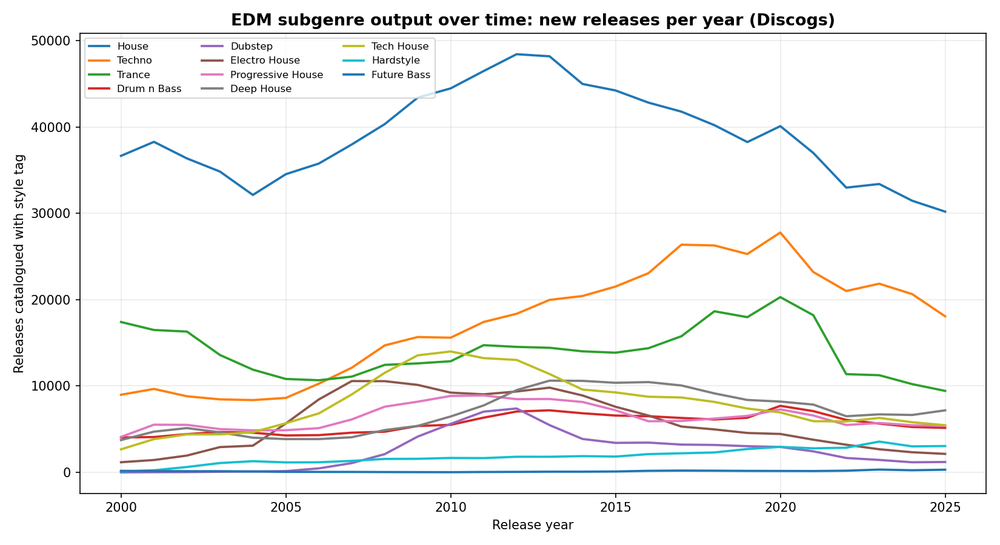
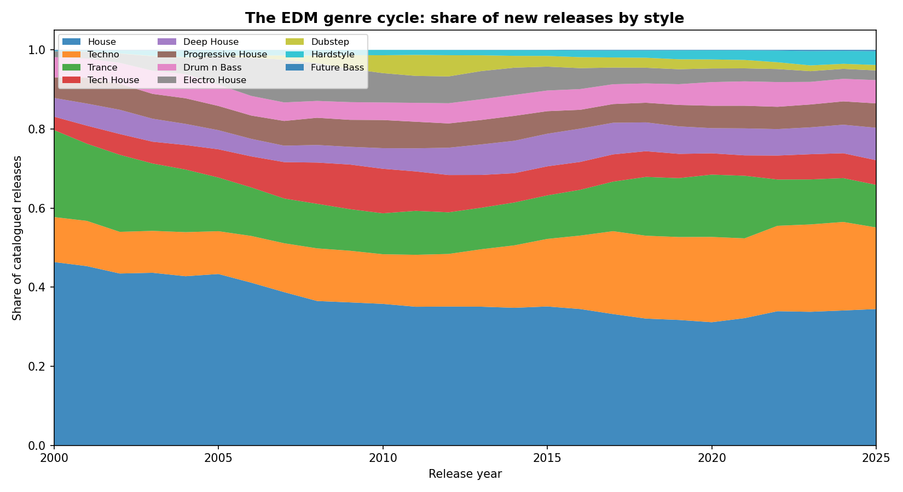
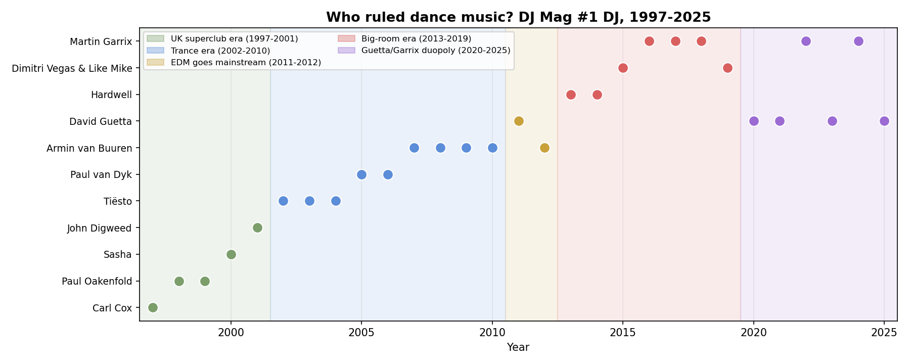
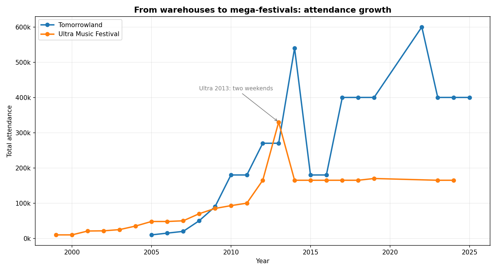

# Three Decades of EDM: How Electronic Dance Music Took Over

**Build #1** · 2026-09-08 · part of the [passion-projects](../../README.md) daily series

A data story in three parts: (1) how EDM subgenres rose and fell, measured through
25 years of release data; (2) who ruled each era, via 29 years of DJ Mag #1 DJs;
(3) how festivals grew from 10,000 ravers to 600,000-strong mega-events.

## Key findings

1. **Genres don't die — they cycle.** Dubstep is the purest boom-bust in the
   data: near zero before 2006, peaking in 2012 (7,398 releases catalogued),
   then collapsing 84% by 2024. Electro house (peak 2007) and tech house
   (peak 2010) trace similar waves a few years apart.
2. **House is the constant, techno the climber.** House was the biggest style
   in every single year 2000–2025; techno rose almost monotonically to its
   2020 peak. Trance traces a U-shape: dominant in 2000, trough around 2005,
   then a surprising second peak in 2020.
3. **The Dutch own the DJ Mag crown.** Dutch DJs won 15 of 29 #1 titles, and
   since 2011 only five acts have topped the poll (Guetta, van Buuren,
   Hardwell, Dimitri Vegas & Like Mike, Garrix).
4. **Festivals scaled 16–40x in two decades.** Ultra: 10,000 (1999) → 165,000;
   Tomorrowland: ~10,000 (2005) → 400,000 (600,000 across three weekends in
   2022).

## The three analyses

### 1. The genre cycle (Discogs, 2000–2025)

Queried the Discogs database API for yearly release counts across 11 EDM
styles. Genres don't die — they cycle: dubstep's early-2010s explosion,
electro house's mid-2010s peak, and the recent tech-house surge are all
visible as waves in the data.




### 2. Who ruled each era (DJ Mag Top 100 #1s, 1997–2025)

The public-vote #1 DJ maps cleanly onto eras: UK superclub DJs (1997–2001),
the trance decade (2002–2010), EDM's mainstream breakthrough (2011–2012),
the big-room era (2013–2019), and the current Guetta/Garrix duopoly.



### 3. From warehouses to mega-festivals

Ultra Music Festival: 10,000 (1999) → 165,000+. Tomorrowland: ~10,000 (2005)
→ 400,000–600,000. Two festivals, 40–60x growth in two decades.



## Data sources

| Data | Source | Collected |
|---|---|---|
| Subgenre release counts | [Discogs](https://www.discogs.com/) database search API (`style` + `year` filters) | 2026-09-08 |
| DJ Mag #1 DJs 1997–2025 | [DJ Mag on Wikipedia](https://en.wikipedia.org/wiki/DJ_Mag) (Top 100 DJs results tables) | 2026-09-08 |
| Festival attendance | [Tomorrowland](https://en.wikipedia.org/wiki/Tomorrowland_(festival)) and [Ultra Music Festival](https://en.wikipedia.org/wiki/Ultra_Music_Festival) Wikipedia attendance tables | 2026-09-08 |

## Methodology & caveats

- Discogs styles are **community-catalogued**; style boundaries (e.g. where
  "house" ends and "tech house" begins) are fuzzy and tagging conventions
  drift. Discogs is a collector database, so the most recent years are
  likely under-catalogued — treat post-2020 dips with skepticism. Counts
  reflect *cataloguing activity*, a good proxy for release output but not a
  perfect measure of cultural dominance.
- An earlier attempt used the MusicBrainz API, but sustained polling got our
  IP temporarily tarpitted (their docs ask for ≤1 req/sec; total volume over
  time matters too). Lesson learned and noted for future builds.
- DJ Mag's poll is a **popularity contest** (its own critics say so) — but
  popularity is exactly what makes it a good proxy for mainstream eras.
- Festival attendance figures are as reported on Wikipedia; counting methods
  vary by year and source (unique visitors vs. total across multiple
  weekends), so treat year-to-year wiggles cautiously.

## Reproduce

```bash
pip install -r requirements.txt
python3 src/01_discogs_styles.py  # ~20 min, 1 request per 3s
python3 src/02_wikipedia_festivals.py
python3 src/03_charts.py
```

## Files

- `src/` — collection + analysis scripts
- `data/` — raw collected data (JSON/CSV)
- `figures/` — generated charts
