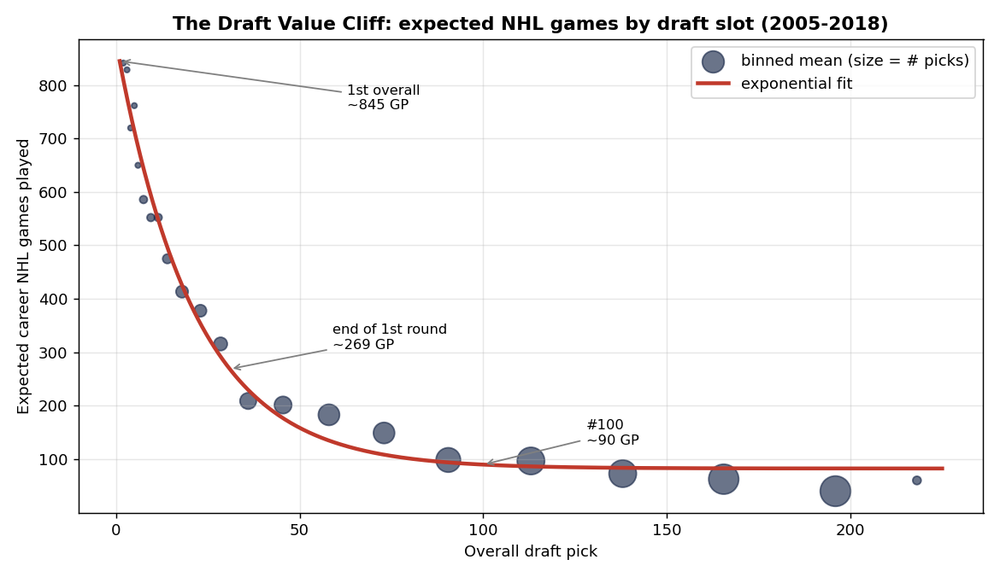
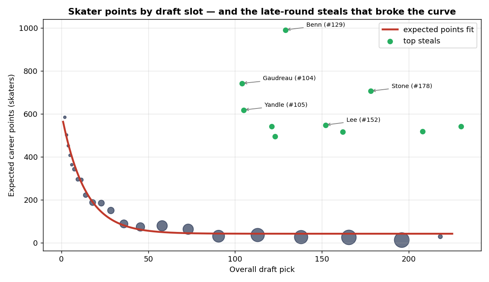
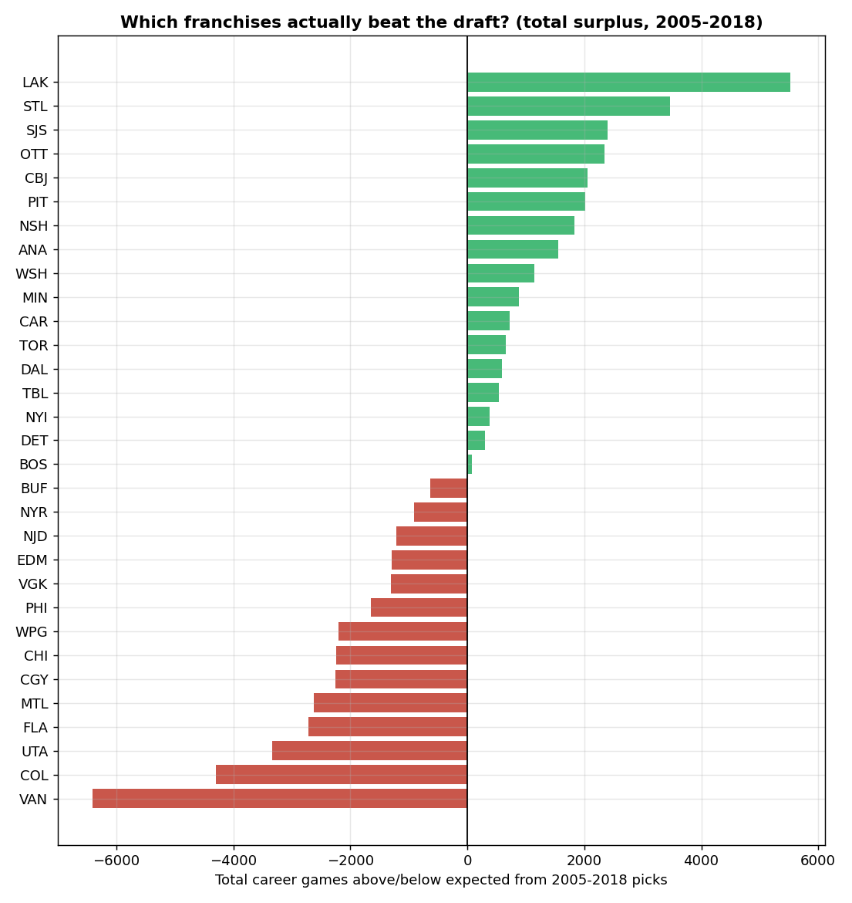
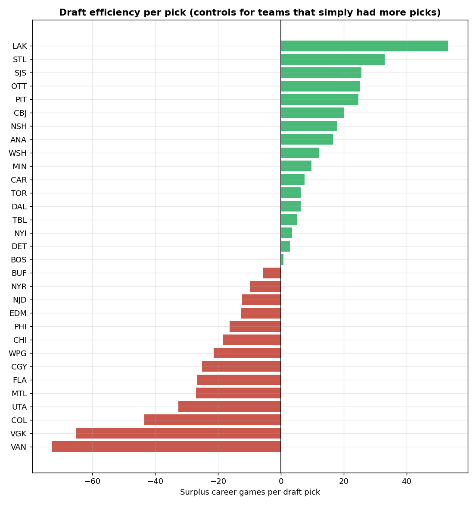
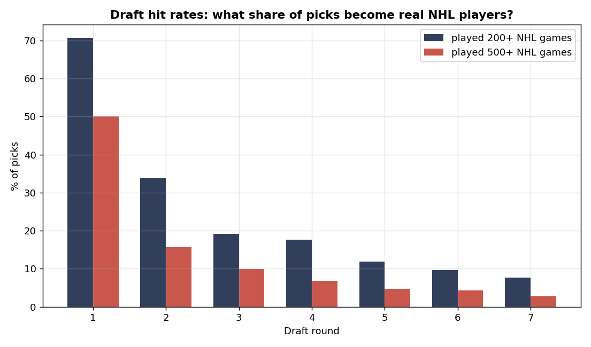

# Draft Surplus: Which NHL Teams Actually Beat the Draft?

**Question:** Every June, 32 NHL teams spend seven rounds picking teenagers.
How much is each draft slot actually worth — and which franchises consistently
get more (or less) out of their picks than the slot says they should?

**Data:** All 2,985 picks from the 2005–2018 NHL Entry Drafts
(`records.nhl.com` API), joined to career NHL regular-season totals for every
player (`api-web.nhle.com`, ~2,975 player profiles fetched Sept 2026).
2018 is the cutoff so even the youngest draftees have 7+ seasons of career
data. Reproducible: `pip install -r requirements.txt`, then run
`src/01_fetch_drafts.py` → `02_fetch_careers.py` → `03_analysis.py`.

## Method

1. **Expected draft value curve.** For each draft slot, we know the *actual*
   career output of every player ever picked there (2005–2018). Bin the slots,
   take the mean career games / points, and fit an exponential decay:
   `E(x) = a·e^(−bx) + c`. That gives an "expected career" for any pick number.
2. **Surplus.** A pick's surplus = actual career value − expected value for
   its slot. A team's draft surplus = the sum over all its picks. This answers
   "who drafted best" while controlling for the fact that some teams simply
   held more (and earlier) picks — we also report surplus *per pick*.
3. Goalies are evaluated on career games played (points are meaningless for
   them); skaters on both games and points.

## Findings

**1. The draft value cliff is brutal — and measurable.**
Fitting expected career output by draft slot (2005–2018, exponential decay):

| Pick | Expected career GP | Expected points (skaters) |
|------|-------------------|---------------------------|
| #1   | ~845 | ~564 |
| #10  | ~582 | ~310 |
| #31 (end of 1st round) | ~269 | ~99 |
| #100 | ~90  | ~43 |
| #200 | ~83  | ~43 |

The first 30 picks carry almost all the expected value. After ~#100 the curve
is flat: a 4th-rounder and a 7th-rounder have nearly identical expected careers.
Half of *all* drafted players (49.7%) never play a single NHL game; in the
first round that figure is just 5.2%. Half of first-rounders reach 500 NHL
games, and 39% of first-round skaters reach 300 career points.

**2. The greatest steals in modern draft history.**
Late picks who shattered their slot's expected value (career points vs
expected):

- Jamie Benn, #129 (DAL, 2007): 992 pts vs ~43 expected (**+949**)
- Johnny Gaudreau, #104 (CGY, 2011): 743 pts (**+700**)
- Mark Stone, #178 (OTT, 2010): 707 pts (**+664**)
- Keith Yandle, #105 (PHX, 2005): 619 pts (**+576**)
- Anders Lee, #152 (NYI, 2009): 549 pts (**+506**)
- Patric Hornqvist, #230 — the *last pick* of 2005 (NSH): 543 pts (**+500**)

**3. Which franchises actually beat the draft (2005–2018)?**
Summing each pick's surplus (actual − expected career games):

- **Best: Los Angeles (+5,522 games, +53/pick).** This is the draft core that
  won the 2012 and 2014 Stanley Cups: Kopitar (#11, 2005), Quick (#72, 2005),
  Simmonds (#61, 2007), Martinez (#95, 2007), Toffoli (#47, 2010).
- St. Louis (+3,466), San Jose (+2,402), Ottawa (+2,347), Columbus (+2,058)
  round out the top five.
- **Worst: Vancouver (−6,404 games, −73/pick)**, then Colorado (−4,304),
  Utah/Arizona (−3,330), Florida (−2,719), Montreal (−2,622). Vancouver's
  deficit is driven by burned early picks — e.g. Olli Juolevi (#5, 2016):
  41 career games.

The per-pick ranking (fig4) tells the same story, so it isn't just "bad teams
had more picks."

**4. Goalies are a different species.**
14 goalies went in the first round (2005–2018) and averaged just 263 career
games — half the 515 of first-round skaters. Drafting a goalie early is, on
average, a worse bet than drafting a skater at the same slot; the great
goalies (Quick #72, etc.) come from the middle rounds.

**5. Busts happen at the very top, too.**
Biggest early-pick disappointments by points shortfall: Griffin Reinhart
(#4, NYI 2012 — 37 NHL games), Nolan Patrick (#2, PHI 2017), Nail Yakupov
(#1, EDM 2012), Olli Juolevi (#5, VAN 2016), Scott Glennie (#8, DAL 2009 —
1 NHL game).

## Figures

- `figures/fig1_value_curve.png` — expected career games by draft slot (the cliff)
- `figures/fig2_steals.png` — skater points curve with the great late-round steals
- `figures/fig3_team_surplus.png` — total franchise draft surplus, 2005–2018
- `figures/fig4_team_per_pick.png` — draft efficiency per pick
- `figures/fig5_hit_rates.png` — hit rates (200+/500+ NHL games) by round

## Sources

- NHL Records API (`records.nhl.com/site/api/draft`) — draft pick data
- NHL Web API (`api-web.nhle.com/v1/player/{id}/landing`) — career totals

Caveats: careers are regular-season only; Atlanta's picks are folded into
Winnipeg and Phoenix/Arizona's into Utah (franchise continuity); players
drafted 2016–2018 may still add to their totals.
