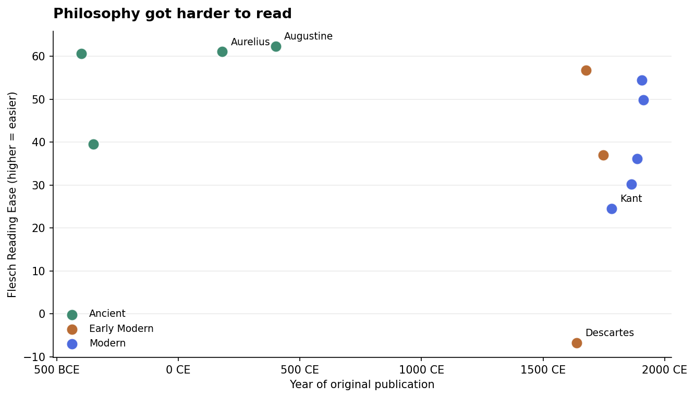
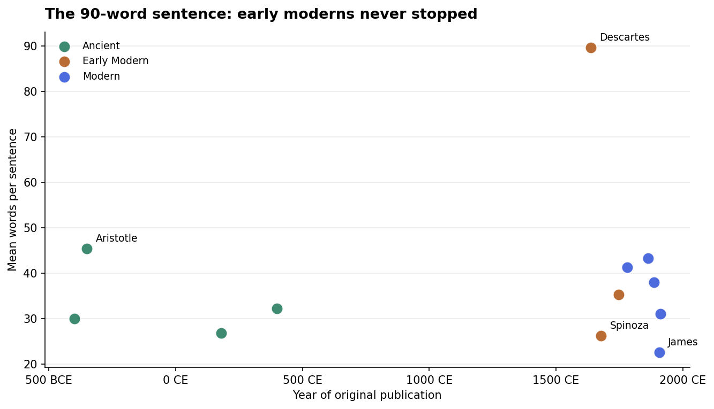
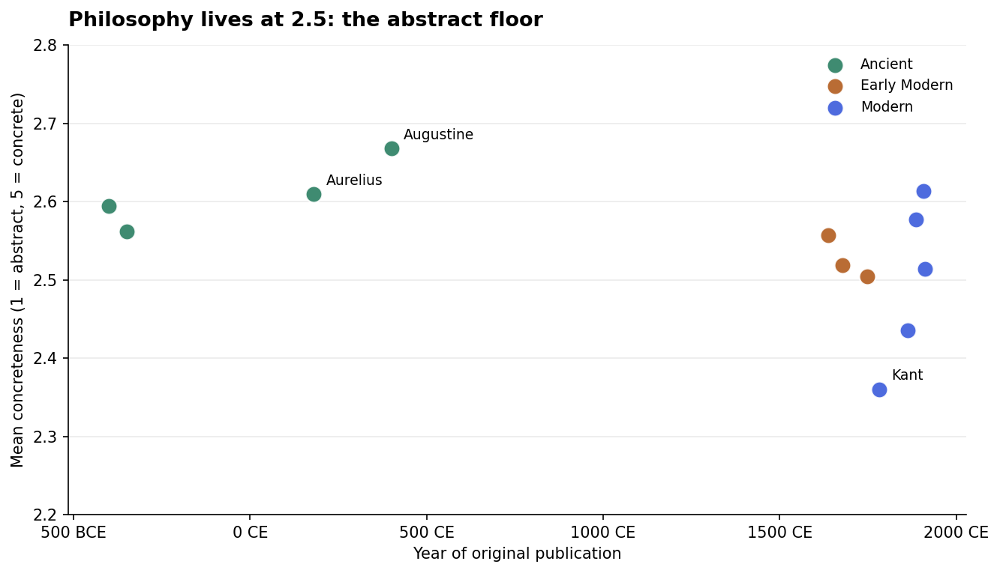
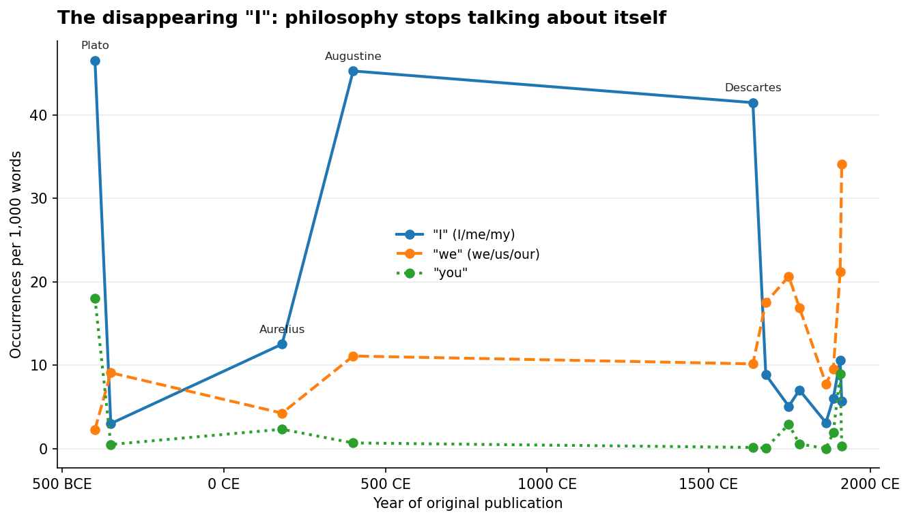
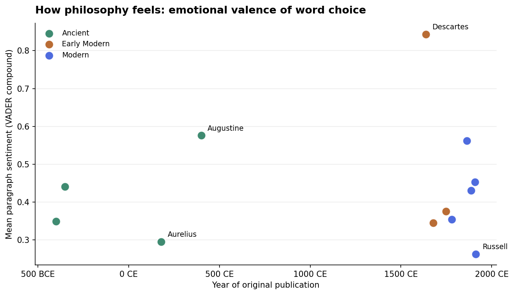
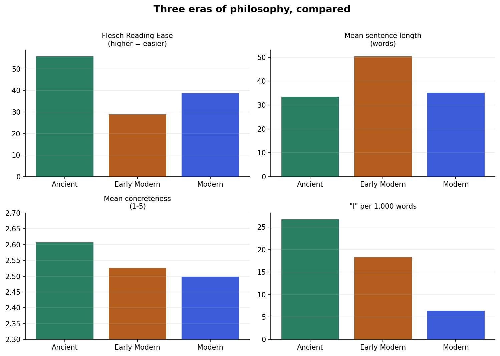

# Philosophy in Data: 2,311 Years of How Philosophers Write

*Twelve philosophical texts, from Plato's Apology (399 BCE) to Russell's Problems of Philosophy (1912), measured on sixteen linguistic metrics — readability, concreteness, sentiment, voice, and abstraction.*

**[Open the interactive explorer →](explorer.html)** — pick any two metrics, hover any dot.

## What this is

A data-driven exploration of a humanities question: **did philosophy get harder to read because the ideas got deeper, or because the writing changed?** The numbers point firmly at the second answer — and the mechanism is visible in the data: over two millennia, the *self* left the page. First-person voice collapsed, abstract nouns multiplied, and sentences swelled, at almost exactly the same rate.

## The corpus

| Text | Author | Year | Words | Gutenberg ID |
|---|---|---|---|---|
| Apology | Plato | 399 BCE | 16,226 | 1656 |
| Nicomachean Ethics | Aristotle | 350 BCE | 113,664 | 8438 |
| Meditations | Marcus Aurelius | 180 CE | 71,889 | 2680 |
| Confessions | Augustine of Hippo | 400 CE | 112,118 | 3296 |
| Discourse on the Method | René Descartes | 1637 | 23,062 | 59 |
| Ethics | Baruch Spinoza | 1677 | 89,110 | 3800 |
| An Enquiry Concerning Human Understanding | David Hume | 1748 | 57,266 | 9662 |
| Critique of Pure Reason | Immanuel Kant | 1781 | 209,794 | 4280 |
| Utilitarianism | John Stuart Mill | 1863 | 27,706 | 11224 |
| Beyond Good and Evil | Friedrich Nietzsche | 1886 | 64,081 | 4363 |
| Pragmatism | William James | 1907 | 52,466 | 5116 |
| The Problems of Philosophy | Bertrand Russell | 1912 | 43,145 | 5827 |

All from [Project Gutenberg](https://www.gutenberg.org) (public domain). Years are original publication dates.

## The essay: The Self Left the Page

Read Plato's *Apology* and you hear a man talking: "I" appears 46 times per thousand words — Socrates defending his life before a jury. Read Augustine's *Confessions* and you hear the same: a man talking to God, 45 "I"s per thousand. Then read Mill's *Utilitarianism* and the speaker is gone: 3 "I"s per thousand. Somewhere between Augustine and Mill, philosophy stopped being something a person *says* and became something a discipline *states*.

The data lets us date the exit. First-person voice falls in a clean staircase across the three eras — 26.8 per thousand in the ancient texts, 18.5 in the early moderns, 6.5 in the moderns. And it isn't replaced by nothing: the moderns say "we." Nietzsche and Kant deploy "we" at 21 per thousand — the authorial "we" of the professional, the voice of someone speaking for a field rather than for himself.

Here's the part that surprised me: **difficulty tracks the disappearing self almost perfectly.** The ancient texts — dialogues, letters, confessions, a diary never meant for publication — average a Flesch Reading Ease of 56, roughly the level of a good magazine. The early moderns drop to 29. The mechanism isn't mysterious once you see it: as the "I" left, sentences got longer (34 → 50 → 35 words), abstract-noun suffixes nearly doubled (28 → 44 → 49 per thousand), and three-syllable words went from 9% of the text to 16%. Impersonal writing *needs* nominalization — you can't say "I think," so you write "the consideration of the aforementioned proposition," and the sentence bloats to carry the machinery.

But the early moderns are the nadir, not the endpoint — and that's the most hopeful number in the set. The two most readable moderns are James's *Pragmatism* (54.4) and Russell's *Problems of Philosophy* (49.8), and both were written for *audiences*: lecture halls and the general reader. When philosophers chose to be understood, they were understood. Readability, the data suggests, was never a law of thought. It was a choice of genre.

Descartes is the beautiful outlier that proves the rule. His *Discourse* scores **−6.7** on Flesch — off the bottom of a scale designed for ordinary prose — with a mean sentence of **90 words**. Yet it has the highest "I" rate of any early modern (41.5 per thousand) and the most positive sentiment in the corpus (0.84). This is a man writing an autobiography of his own mind in sentences a paragraph long: intimate and unreadable at once. The self hadn't left yet; the syntax just couldn't hold it.

Two smaller findings worth keeping:

1. **Philosophy has a concreteness floor.** On the Brysbaert scale where "apple" is 5.0 and "justice" is 1.45, all twelve texts sit between 2.36 and 2.67. Two millennia of stylistic revolution moved the needle 0.3 points. Philosophy, whatever else it does, stays at the same altitude of abstraction — Kant merely flies lowest (2.36).

2. **The "pessimists" don't write darkly.** VADER sentiment — a blunt instrument, but applied uniformly — finds every text net positive, and Nietzsche (0.43) scores *above* Marcus Aurelius (0.30). Nietzsche's darkness is in the irony, which no lexicon can see; what the numbers catch is that he, like Descartes, *enjoyed* writing. The grimmest number belongs to Russell (0.26), the logician — precision reads as flat affect.

The thesis, then: philosophy didn't get harder because reality got more complicated. It got harder when the genre shifted from speech to treatise — from the courtroom, the letter, and the confession to the monograph — and the author erased himself to sound like a discipline. The good news is that the erasure was a convention, and conventions can be unlearned. James and Russell prove it: the moment philosophy remembered it had an audience, the sentences shortened and the "I" crept back in.

## Figures








## Methods

- **Texts:** fetched from Project Gutenberg, boilerplate stripped (`src/01_download.py`).
- **Readability:** Flesch Reading Ease, Flesch-Kincaid grade, Gunning Fog — implemented directly from the standard formulas with a heuristic syllable counter (the usual NLTK data files were unavailable in this environment, so no `textstat`).
- **Concreteness:** mean Brysbaert, Warriner & Kuperman (2014) rating (1 = abstract, 5 = concrete) over rated content words; ~100k lemmas, bundled via the `wordtangible` package, vendored in `data/concreteness_brysbaert2014.csv`.
- **Sentiment:** VADER compound, averaged over paragraphs (valence of word choice, not a claim about doctrine).
- **Voice:** counts of first-person singular/plural and second-person pronouns, questions, and exclamations per 1,000 words; abstract-noun density via suffix heuristics (`-tion`, `-ness`, `-ity`, `-ism`, …).
- **Explorer:** `src/04_explorer.py` generates the self-contained `explorer.html` from `data/metrics.csv`.

### Caveats, stated plainly

- Every text is an English **translation** (Jowett's Plato, the Veitch Descartes, etc.), often Victorian. Absolute scores reflect translators; the *trends* across eras are the signal, and they survive any single translation choice.
- Twelve texts is a canon, not a sample. The history of philosophy is bigger than its greatest hits.
- VADER was trained on social-media English; on 17th-century prose it measures word-choice valence, roughly. Treat the sentiment panel as suggestive, not decisive.

## Sources

- Texts: Project Gutenberg — ebook IDs 1656, 8438, 2680, 3296, 59, 3800, 9662, 4280, 11224, 4363, 5116, 5827.
- Concreteness norms: Brysbaert, M., Warriner, A.B., & Kuperman, V. (2014). *Concreteness ratings for 40 thousand generally known English word lemmas.* Behavior Research Methods, 46, 904–911. (via the `wordtangible` Python package)
- Sentiment: Hutto, C.J. & Gilbert, E.E. (2014). *VADER: A Parsimonious Rule-based Model for Sentiment Analysis of Social Media Text.* ICWSM.
- Readability formulas: Flesch (1948); Kincaid et al. (1975); Gunning (1952).

## Reproduce

```bash
cd 2026-09-10/philosophy-in-data
pip install -r requirements.txt
python3 src/01_download.py   # fetch + clean texts from Project Gutenberg
python3 src/02_metrics.py    # compute metrics -> data/metrics.csv
python3 src/03_charts.py     # figures -> figures/
python3 src/04_explorer.py   # explorer.html
```

## Files

- `src/` — the four-stage pipeline
- `data/` — `corpus.csv`, `metrics.csv`, cleaned texts in `data/texts/`, vendored concreteness norms
- `figures/` — six charts
- `explorer.html` — interactive scatter explorer (open in any browser)
- `findings.txt` — the numbers, plain
