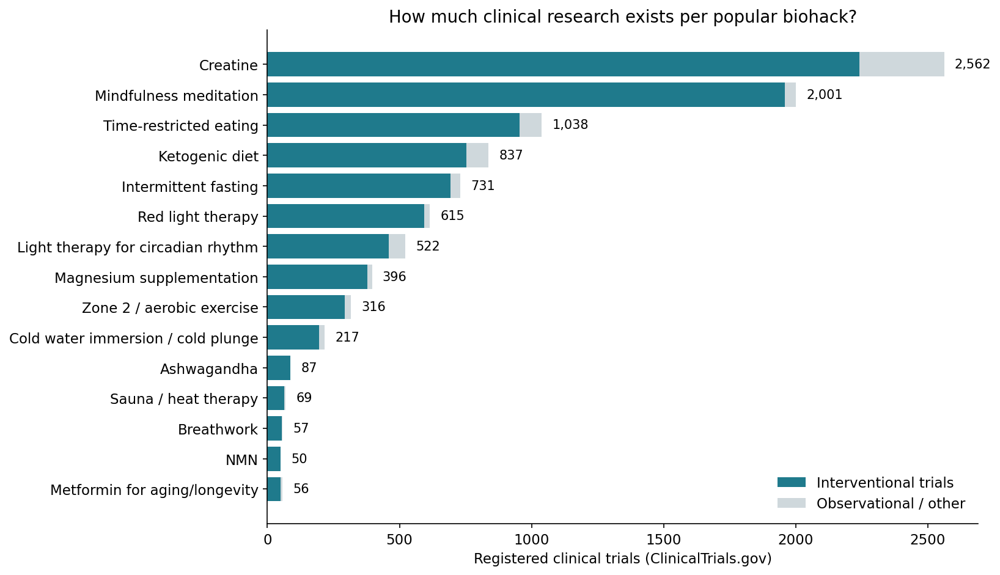
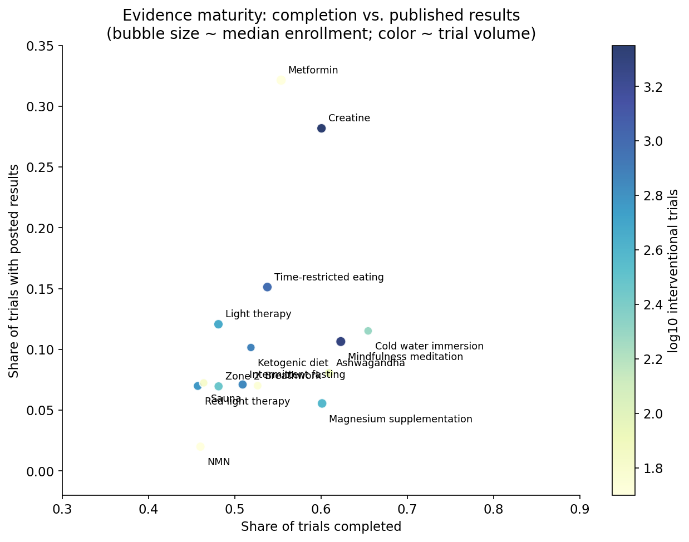
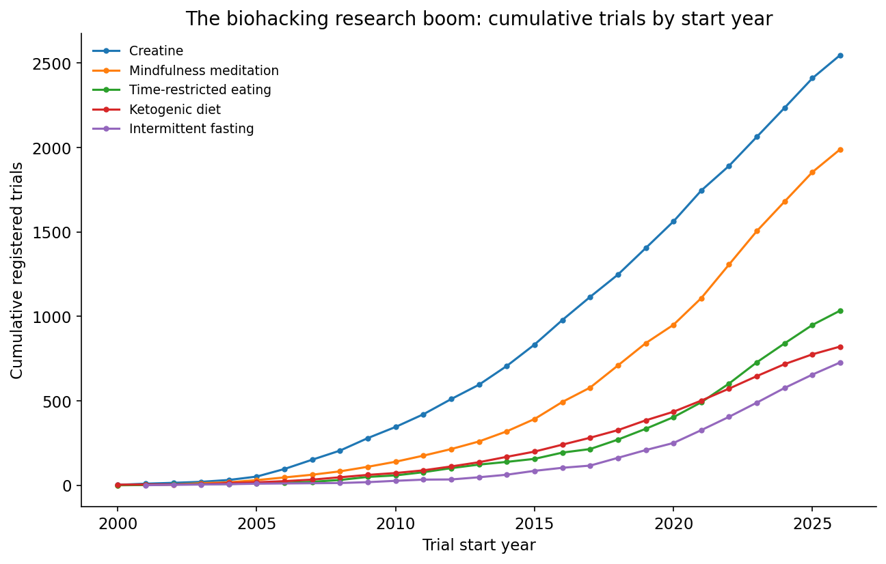
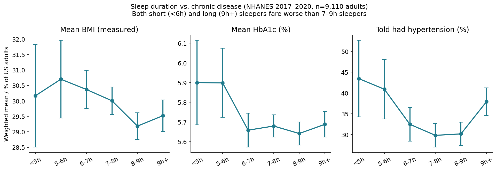
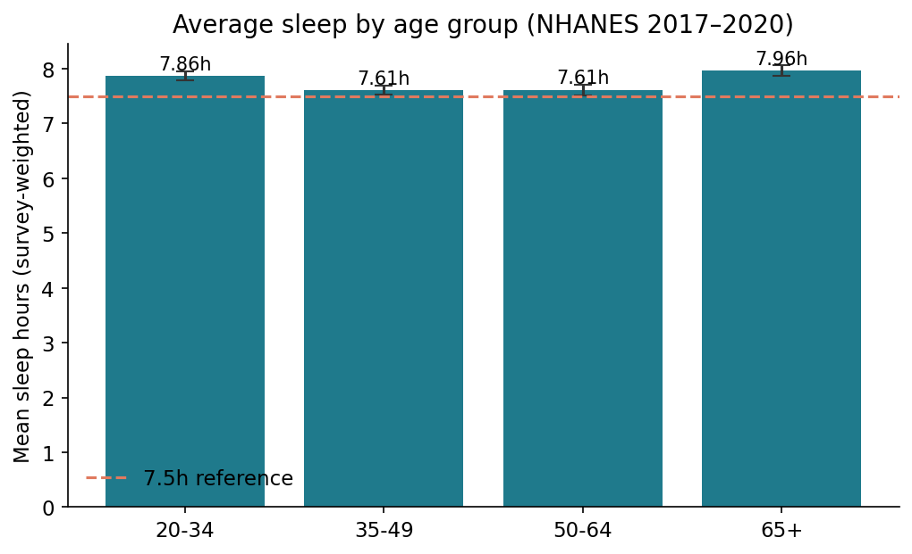

# The Biohacking Evidence Audit

**Date:** 2026-09-13 · **Topic:** biohacking · Part of the [Daily builds](https://github.com/mzhou-ds/passion-projects) series — *Musing with Mike*

Two questions, two public datasets:

1. **How much clinical evidence actually backs popular biohacks?** → 9,554 registered trials across 15 biohacks, pulled from the ClinicalTrials.gov API v2.
2. **Does the single highest-leverage biohack (sleep) show up in population health?** → NHANES 2017–2020 pre-pandemic data, n = 9,110 US adults, survey-weighted.

## What I built

- `src/01_fetch_trials.py` — queries the ClinicalTrials.gov API v2 for 15 biohack terms (cold plunge, sauna, red light, fasting variants, NMN, metformin, creatine, meditation, breathwork, light therapy, keto, ashwagandha, magnesium, zone 2), and summarizes trial counts, study types, phases, statuses, enrollment, results availability, and start-year trends → `data/trials_summary.json`
- `src/02_sleep_analysis.py` — merges NHANES files (P_DEMO, P_SLQ, P_BMX, P_GHB, P_BPQ, P_DIQ) on SEQN; computes survey-weighted health markers by habitual sleep duration → `data/health_by_sleep.csv`, `data/mean_sleep_by_age.csv`, `data/sleep_headlines.json`
- `src/03_make_charts.py` — five publication-style charts → `charts/`
- `data/DATA_SOURCES.md` — every source and how to reproduce

## Findings

**1. The evidence is wildly uneven.** Creatine (2,562 trials) and mindfulness meditation (2,001) have real research programs. Sauna (69), breathwork (57), and NMN (50) — three of the most hyped interventions on the internet — barely exist in clinical research. Only 30 cold-plunge trials are recruiting right now.

**2. Biohacking trials are tiny.** Median enrollment across all 15 categories is just 36–70 participants per trial. Cold plunge: 38. Sauna: 36. Red light: 45. The typical study behind your favorite influencer's claims has fewer people than a yoga class.

**3. Results often never surface.** Of completed trials, the share with results actually posted on ClinicalTrials.gov: metformin 32%, creatine 28%, mindfulness 11%, red light 7%, NMN 2%. Registration is not publication.

**4. The fasting boom is real, and recent.** Time-restricted eating trials took off after ~2016 (now 1,038); intermittent fasting and keto followed. Creatine and meditation research have been compounding for 20+ years.

**5. Sleep is the king of biohacks — and the data says so.** In NHANES (survey-weighted, US-representative), 22.4% of adults sleep under 7 hours. People sleeping under 6 hours have meaningfully worse markers than 7–9h sleepers: mean BMI 30.7 vs 29.2, HbA1c 5.90% vs 5.64%, hypertension prevalence 43% vs 30%. Sleeping 9+ hours looks worse too — a classic U-shape. Sleep also dips in middle age (7.6h at 35–64 vs 7.9h at 65+).

**Bottom line:** the most evidence-backed "biohack" is free and unsexy — sleep 7–9 hours. The most hyped ones (NMN, cold plunge, sauna) rest on dozens of tiny trials with few published results.

## Charts







## Reproduce

```bash
pip install -r requirements.txt
python3 src/01_fetch_trials.py    # ~2 min, hits ClinicalTrials.gov API
python3 src/02_sleep_analysis.py  # needs data/nhanes/*.xpt (see DATA_SOURCES.md)
python3 src/03_make_charts.py
```

## Caveats

- Search terms are keyword-based; broad terms (e.g. "creatine supplementation") sweep in adjacent research (sports performance, kidney/creatinine studies). Treat counts as upper bounds.
- "Results posted" counts structured results on ClinicalTrials.gov only; many trials publish in journals without posting there.
- NHANES sleep is self-reported habitual duration; associations are cross-sectional, not causal. Survey weights applied, but standard errors in the extreme sleep bins are wide (small n).
