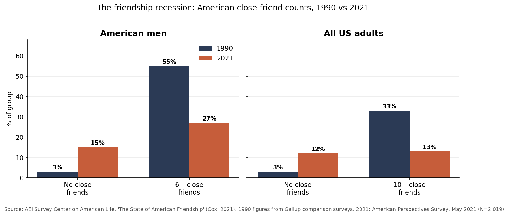
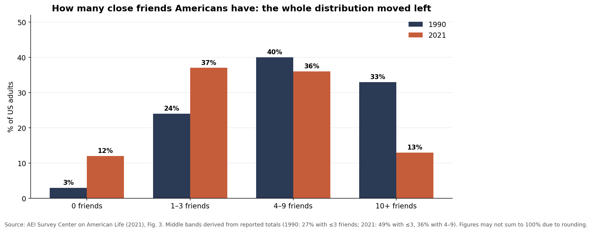
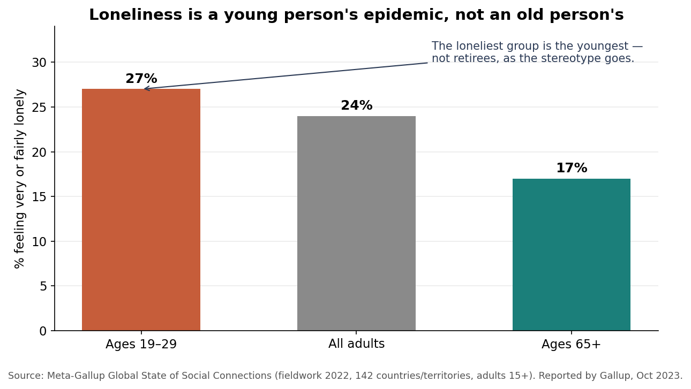
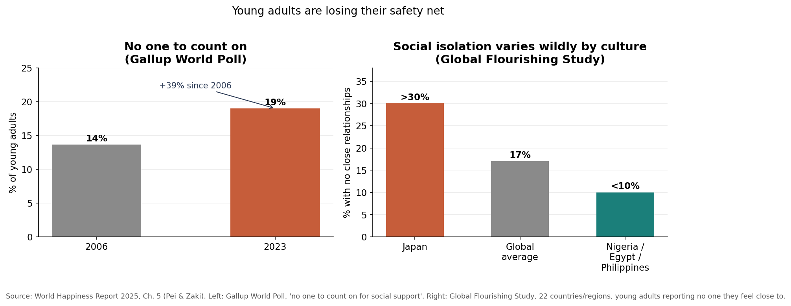
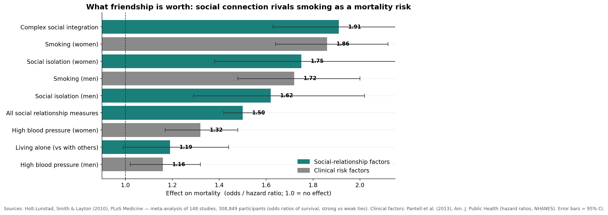
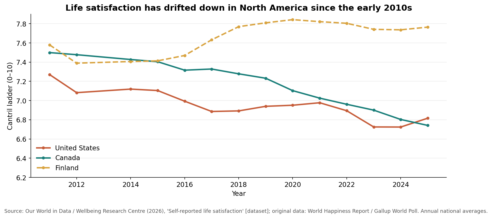

# The Friendship Portfolio

*Why your relationships behave like investments — and why most of us are systematically underfunded.*
A data essay + interactive model · **Musing with Mike** · 2026-09-16

---

## The thesis

Nobody teaches you that friendship has a **maintenance cost**. We talk about
relationships in the language of feelings — closeness, loyalty, love — but they
run on the most finite currency there is: hours. Every tie in your life bills you
monthly, and the bill is denominated in attention.

So here's the argument of this piece: **a friendship network is a portfolio.**
It has asset classes (Dunbar's layers: the intimate 5, the close 15, the wider 50,
the acquaintances 150), each with its own maintenance fee and expected return.
It compounds — trust deepens with repeated investment. It needs diversification —
different friends insure different risks. And it needs periodic rebalancing,
because life keeps reallocating your time without asking.

Viewed this way, the last thirty years of American social life look less like a
mystery and more like a balance sheet in trouble. And the data suggests most of
us are making the same portfolio error: **overweighting cheap, low-return ties
and starving the expensive ones that actually compound.**

---

## Part 1 — The friendship recession

In 1990, 55% of American men had six or more close friends. By 2021, that was
27% — cut in half. Over the same period, the share of men with **no close
friends at all** quintupled, from 3% to 15%. One in five single, unpartnered men
now reports having nobody. (AEI Survey Center on American Life, Cox 2021;
American Perspectives Survey, May 2021, N=2,019; 1990 = Gallup comparison.)



It wasn't just men, and it wasn't just the extremes. The entire distribution
shifted left: in 1990, 33% of Americans had ten or more close friends and 27%
had three or fewer. By 2021, only 13% had ten-plus, while **49% — close to
half — had three or fewer.** The modal American friendship portfolio shrank
from a diversified fund to a concentrated position in two or three names.



Two details in the report deserve more attention than they get:

1. **Quality decayed faster than quantity.** Women received emotional support
   from a friend in the past week at nearly double the rate of men (41% vs 21%),
   shared personal feelings at 48% vs 30%, and told a friend they loved them at
   49% vs 25%. Men didn't just lose friends — the friendships they kept got
   shallower. In portfolio terms: the remaining holdings stopped paying dividends.
2. **One friend is barely better than zero.** The AEI researchers found that
   Americans with a single close friend were *no less lonely* than those with
   none. Diversification has a minimum viable size — a portfolio of one is
   effectively undiversified. Satisfaction with one's friend count rises almost
   linearly with each added friend (29% satisfied at zero friends → 56% at four
   or five), and more than half of people with three or fewer friends felt lonely
   in the past week.

A note on honesty: the 1990↔2021 comparison spans a change in survey mode (phone
vs. online panel), so the exact magnitude is debated. The direction isn't.

---

## Part 2 — It's global, and it's the young

The American story is not an American story. Meta and Gallup's first-ever global
loneliness study (142 countries, 2022 fieldwork) found **24% of the world's
adults feel very or fairly lonely** — and the age gradient runs exactly opposite
to the stereotype:



The loneliest people on earth are 19-to-29-year-olds (27%); the least lonely are
65+ (17%). The "lonely old widow" is real but rare; the lonely 24-year-old
scrolling at 1am is the statistical norm.

The World Happiness Report 2025 devotes a full chapter to young adults' social
connection (Pei & Zaki, Stanford), and its headline number is stark: **19% of
young adults worldwide had no one they could count on for social support in
2023 — a 39% increase since 2006.** In the Global Flourishing Study's 22
countries, 17% of young adults report having *nobody they feel close to* —
over 30% in Japan, under 10% in Nigeria, Egypt, and the Philippines. Culture
sets the baseline; the trend is downward almost everywhere.



The same chapter offers the single most actionable finding in this whole
project: for university students, **forming friendships in the first few weeks
of college** increased the likelihood of flourishing and reduced depressive
symptoms years later. Early deposits compound the longest. Friendship has a
time value of money.

---

## Part 3 — The stakes: what the asset is actually worth

Why should a data person care about any of this? Because the returns are
measurable in the hardest currency available: mortality.

Holt-Lunstad, Smith & Layton's 2010 meta-analysis in *PLoS Medicine* — 148
studies, 308,849 people, average 7.5 years of follow-up — found that people
with stronger social relationships had **50% higher odds of survival**
(OR = 1.50, 95% CI 1.42–1.59). For complex measures of social integration the
effect was OR = 1.91. Put on the same axis as the risk factors your doctor
actually asks about:



Social isolation predicts death about as well as **smoking** (Pantell et al.,
2013: isolation HR 1.62–1.75 vs. smoking HR 1.72–1.86) and far better than
hypertension. The U.S. Surgeon General's 2023 advisory called loneliness an
epidemic; the numbers say it deserves the same policy seriousness as tobacco.

And it's not just about not dying. The Harvard Study of Adult Development —
running since 1938, the longest study of human happiness ever conducted —
concludes, in Robert Waldinger's summary: *"Good relationships keep us happier
and healthier. Period."* Not wealth, not fame, not cholesterol: relationship
quality at 50 predicted health at 80 better than any biomarker they measured.

Meanwhile, the aggregate mood has been drifting. Life satisfaction in the U.S.
and Canada has slid since the early 2010s on the Cantril ladder (Gallup World
Poll via Our World in Data), even as GDP kept climbing:



Correlation isn't causation — but it is suggestive that the decades in which
friendship portfolios shrank are the same decades in which self-reported life
evaluation flatlined in rich countries.

---

## Part 4 — The portfolio model

Here's where the essay becomes a tool. Dunbar's layers give us natural asset
classes:

| Layer | Size | Role in portfolio | Illustrative upkeep |
|---|---|---|---|
| Inner circle | ~5 | Core holdings — the 2am-call people | ~4 hrs/month each |
| Close friends | ~15 | Growth — monthly contact compounds | ~1.5 hrs/month each |
| Good friends | ~50 | Diversified index — weak ties, novel info | ~0.5 hrs/month each |
| Acquaintances | ~150 | Cash position — cheap, low return | ~0.15 hrs/month each |

Do the arithmetic and the cruelty of the math appears: a full inner circle
costs ~20 hours a month *before you've spoken to anyone else*. A full Dunbar
house of 150 costs roughly 40+ hours a month — a part-time job. Nobody has
that, which is why everyone is constantly, quietly defaulting on friendship
debt.

**[Try the interactive model →](app/index.html)** — set your weekly social
budget, allocate it across the layers, and watch which relationships your
calendar can actually fund. Three presets included: the average American (AEI's
2021 distribution), the inner-circle investor, and the networker.

The model's uncomfortable lesson: the networker with 10 hours a week spread
across 150 people *starves the inner circle* — the exact layer where the
mortality and happiness returns concentrate. Breadth feels productive;
concentration pays.

---

## Part 5 — Rebalancing rules

If friendships are a portfolio, here are five allocation rules the data supports:

1. **Fund the inner circle first.** Returns concentrate there: emotional support
   from friends reduces anxiety and loneliness *independent of how many friends
   you have* (AEI). Five deep beats fifty shallow.
2. **Respect the minimum viable diversification.** One close friend ≈ zero for
   loneliness (AEI). Three is the inflection point where isolation becomes common.
   Hold at least 3–5 real positions.
3. **Invest early; it compounds.** Friendships formed in the first weeks of
   college pay out for years (WHR 2025). The same applies to new cities, new
   jobs, new parenthood — front-load the deposits.
4. **Rebalance after life events.** Marriage, kids, moves, and career sprints
   silently reallocate your time budget. The AEI data shows married men
   outsourcing emotional support to spouses (85% talk to their spouse first) —
   efficient in the short run, fragile as a single point of failure.
5. **Audit annually.** Ask: which five people would I call at 2am, and did each
   get four hours of me this month? Portfolios that are never rebalanced drift.

---

## Run it yourself

```bash
pip install -r requirements.txt
python fetch_data.py    # downloads the OWID Cantril panel (data/cantril_ladder_owid.csv)
python analyze.py       # rebuilds all six charts from data/
# then open app/index.html in a browser for the interactive model
```

## Structure

```
2026-09-16/friendship-portfolio/
├── README.md              # this essay
├── fetch_data.py          # downloads the OWID/WHR Cantril panel
├── analyze.py             # builds charts/ from data/
├── requirements.txt
├── data/
│   ├── SOURCES.md                     # full citations + caveats
│   ├── aei_friendship.csv             # AEI 2021 topline (transcribed)
│   ├── gallup_loneliness_by_age.csv   # Meta-Gallup 2022 (transcribed)
│   ├── whr2025_young_adults.csv       # WHR 2025 Ch.5 figures (transcribed)
│   ├── mortality_effect_sizes.csv     # Holt-Lunstad + Pantell (transcribed)
│   └── cantril_ladder_owid.csv        # OWID/WRC panel 2011–2025 (downloaded)
├── charts/                # 6 PNG figures
└── app/
    └── index.html         # interactive Friendship Budget calculator
```

## The one-line version

Friendship is the highest-return asset most of us systematically underfund —
the data prices strong social ties alongside quitting smoking, and the last
thirty years show what happens when everyone quietly stops paying the
maintenance fees. Rebalance accordingly.
