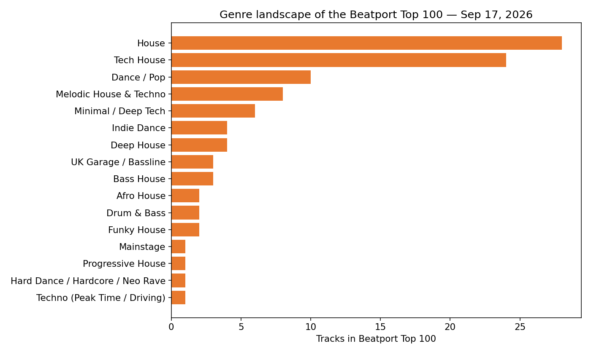
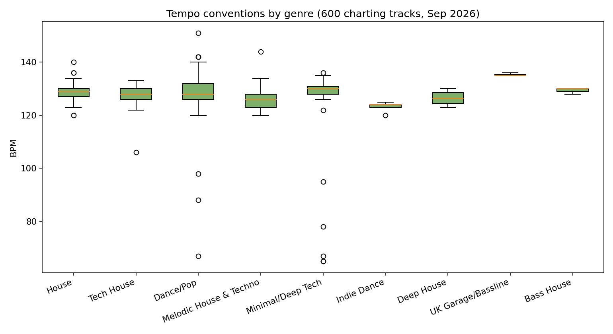
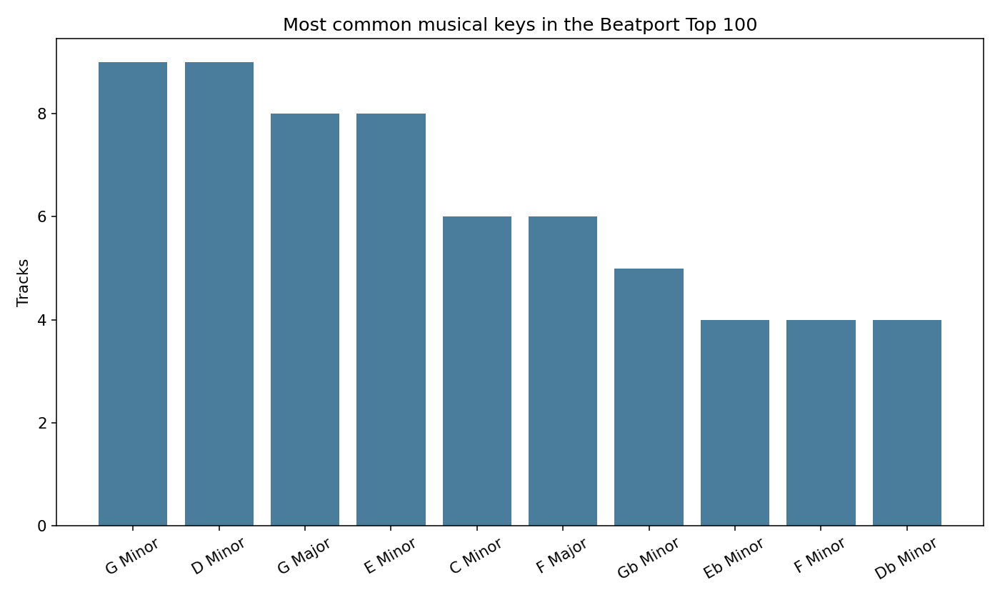
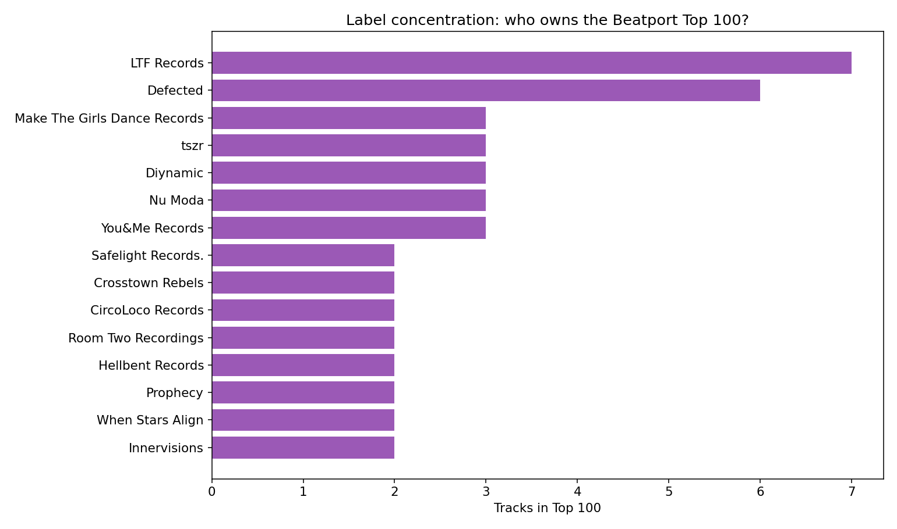
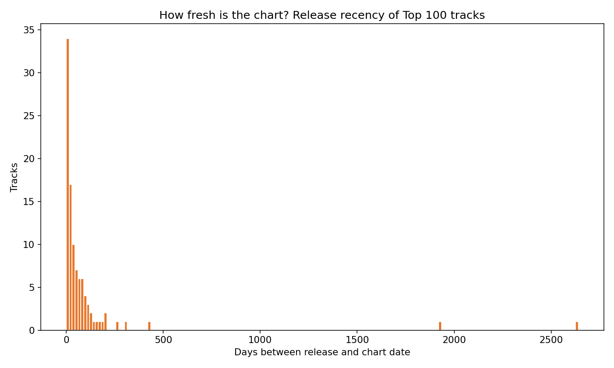
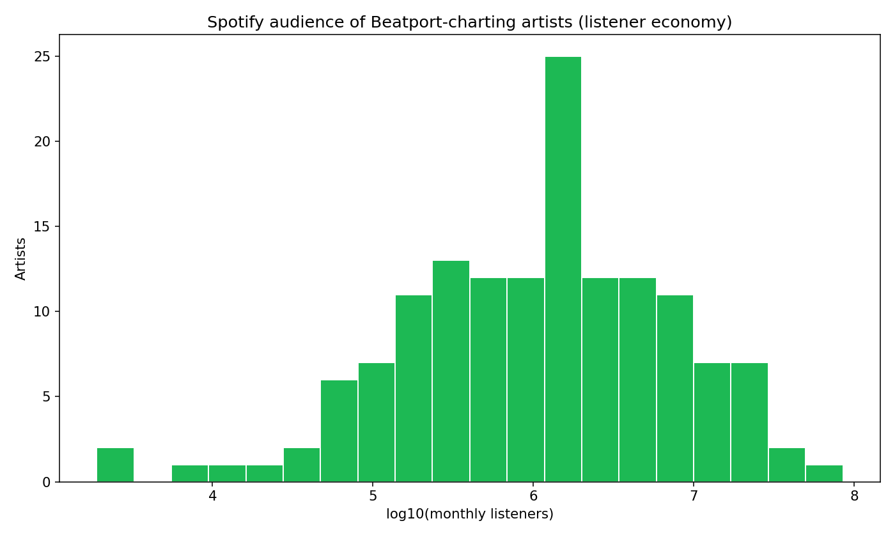

# Anatomy of a Chart: Decoding What's Hot in EDM Right Now

**Build #10** · 2026-09-17 · part of the [passion-projects](../../README.md) daily series

Build #1 traced 25 years of EDM history. This build zooms into the present:
what does the music that's *actually charting today* look like, structurally?
I scraped the Beatport Top 100 plus five genre Top 100s (600 tracks, Sep 17,
2026) and decoded their BPM, musical key, label, release date, mix format and
artist credits — then cross-checked the charting artists against Spotify to
compare the DJ economy (Beatport) with the listener economy (Spotify).

## Key findings

1. **The house family owns the chart.** House (28) + Tech House (24) = 52% of
   the Beatport Top 100. Dance/Pop crossover (10) and Melodic House & Techno
   (8) fill most of the rest. Trance, techno and drum & bass are nearly
   absent from the top 100 — a long way from the trance decade.

2. **128 BPM is the gravitational center of dance music.** Across all five
   genre charts, the modal tempo is 128–130 BPM and genre medians span just
   126–130 BPM. Genres differ far less in tempo than their names suggest —
   the UK Garage/Bassline corner (135 BPM) is the only real outlier.

3. **The chart runs on minor keys.** 60% of Top 100 tracks are in a minor
   key; G minor and D minor tie for the most common key (9 tracks each).
   No single key dominates — the top two of 24 possible keys hold just 18%.

4. **The DJ chart is an indie economy.** 66 different labels appear in the
   Top 100, and 94% of charting tracks are on independents. The majors
   (Universal, Sony, Warner, Interscope, Atlantic) hold just 6 tracks —
   all in the Dance/Pop crossover lane. LTF Records (7) and Defected (6)
   lead; the top 5 labels own only 22% of the chart.

5. **Freshness is everything.** The median charting track was released 29
   days ago; 51% are under 30 days old. Beatport's chart is a new-release
   economy — catalog tracks essentially never chart.

6. **The DJ format: extended, collaborative, long.** 58% of charting tracks
   are extended mixes (median length 5.5 minutes), 54% credit more than one
   artist, and only 7% are remixes — originals rule the chart.

7. **Two economies, one scene.** The Beatport #1 (Mau P's "Just A Little Bit
   More") has ~5M monthly Spotify listeners, while the chart's biggest
   Spotify name — David Guetta at 84.9M — sits at #35 and #71. 66 of 145
   charting artists have under 1M monthly listeners: Beatport is a
   working-DJ economy, not a popularity contest.

## The four analyses

### 1. The genre landscape and the tempo standard




The Top 100 is a house chart with a tech-house wing. And whatever the genre
tag says, the kick drum lands at 128–130 BPM: House's mode is 130, Tech
House's 128, Dance/Pop's 128, Melodic's 128, Minimal/Deep Tech's 130. The
low-BPM dots in Dance/Pop and Minimal/Deep Tech are half-time/hip-hop
crossover tracks tagged at half tempo. For DJs, the takeaway is practical:
tracks are engineered to mix into each other.

### 2. Keys: the minor-key bias



60/100 tracks are minor-key. The "chart keys" — G minor, D minor, G major,
E minor — are all friendly to both piano-roll producers and open-format
DJs (few accidentals, comfortable vocal ranges).

### 3. The label economy: 94% independent



Two veteran independents, LTF Records and Defected, top the label table,
but nobody dominates: it takes the top 10 labels to cover just 34% of the
chart. Compare that to the Hot 100, where three majors own the board. The
six major-label tracks in the Top 100 are all Dance/Pop crossovers
(Interscope, Atlantic, Warner, Universal, Columbia/B1) — the majors only
touch the DJ chart where it meets pop radio.

### 4. Freshness and format



82 of 100 tracks were released within 90 days. The Beatport chart is not
a hall of fame — it's a release radar with a ~3-month memory.

### 5. Beatport vs Spotify: the DJ economy and the listener economy



I looked up all 149 unique charting artists on Spotify (145 clean matches;
4 ambiguous names excluded). The distribution is brutally skewed: median
artist has 1.39M monthly listeners, but 66 of 145 sit under 1M — the
underground acts DJs actually buy — while 17 clear 10M, led by David Guetta
(84.9M), HUGEL (41.1M), French Montana (31.0M) and Alok (24.8M).

The punchline: chart rank on Beatport barely tracks Spotify fame. The #1
track is Mau P (~5M listeners); Guetta — the biggest name in the dataset —
charts at #35 and #71. 41 of 100 tracks' *biggest* credited artist has under
1M monthly listeners. The DJ chart rewards what's mixable and fresh, not
what's famous — which is exactly why it's useful signal rather than a
popularity echo.

## Data sources

| Data | Source | Collected |
|---|---|---|
| Beatport Top 100 (100 tracks) | [beatport.com/top-100](https://www.beatport.com/top-100) | 2026-09-17 |
| Genre Top 100s: House, Tech House, Dance/Pop, Melodic House & Techno, Minimal/Deep Tech (100 each) | [beatport.com/genre/.../top-100](https://www.beatport.com) | 2026-09-17 |
| Artist monthly listeners | Spotify search API via `spotify-api` CLI | 2026-09-17 |

## Methodology & caveats

- Beatport's Next.js pages embed chart data as JSON (`__NEXT_DATA__`), so
  each chart is one HTTP GET — no API key, no scraping of rendered HTML.
  Snapshot is from Sep 17, 2026; charts move daily, so re-run
  `src/fetch_charts.py` to refresh.
- Beatport charts reflect DJ purchasing/streaming behavior, not general
  listening — that's the point of the comparison, not a flaw.
- BPM values are as tagged by Beatport; half-time tracks (hip-hop tempo
  tagged at ~70 BPM) appear as low outliers in Dance/Pop.
- Key data comes from Beatport's own key detection; enharmonic spellings
  (e.g. Gb vs F#) follow their convention.
- Spotify matching is by artist name against the first search result;
  ambiguous names are flagged `fuzzy` in the raw data.

## Reproduce

```bash
cd 2026-09-17/anatomy-of-a-chart
python3 src/fetch_charts.py   # re-scrape the 6 charts -> data/tracks.csv
python3 src/analyze.py        # analysis + figures/*.png
```
