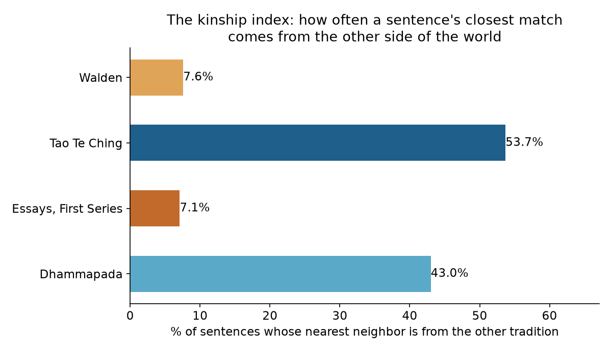
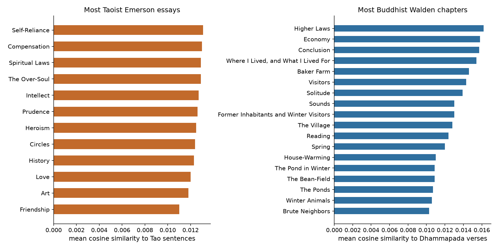
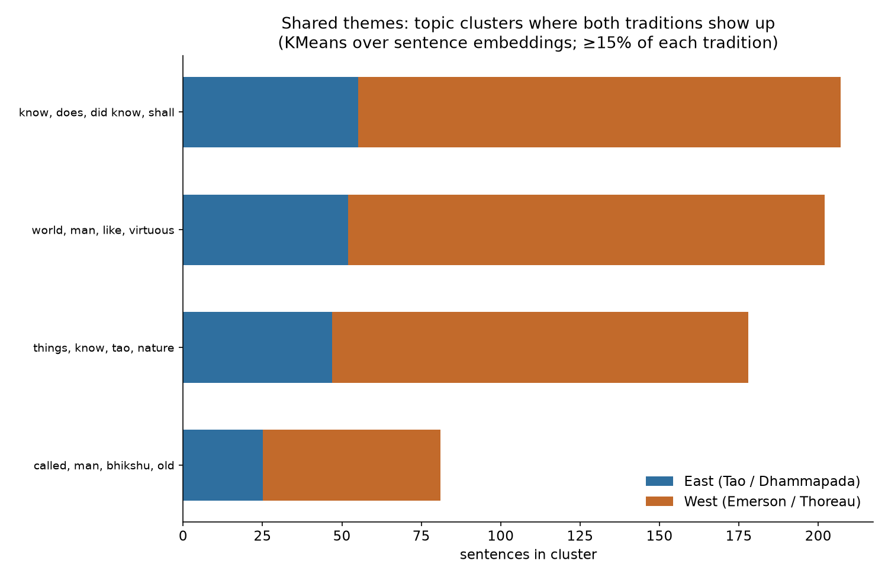
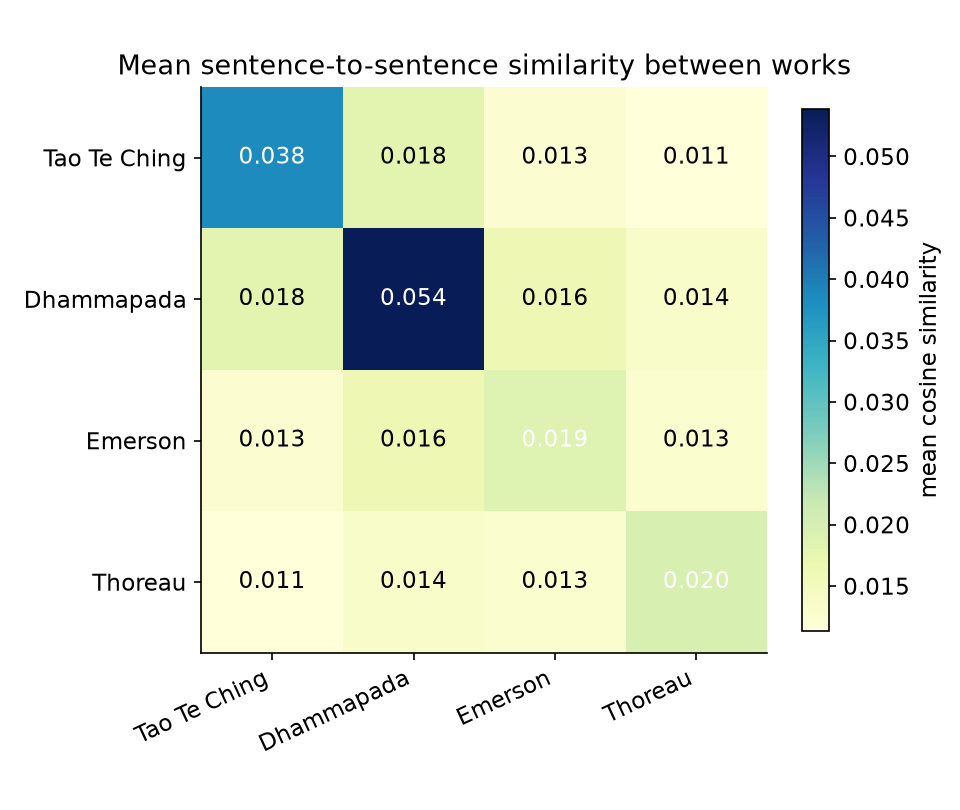

# Laozi and Emerson Wrote the Same Essay

*An embedding-based investigation into whether Eastern non-duality and American Transcendentalism converged on the same ideas — 2,200 years and 7,000 miles apart.*

**Corpus:** 7,564 sentences from four public-domain texts — the *Tao Te Ching* (Legge, 1891; Project Gutenberg #216), the *Dhammapada* (Müller, 1881; PG #2017), Emerson's *Essays, First Series* (1841; PG #2944), and Thoreau's *Walden* (1854; PG #205).

**Method:** every sentence embedded with LSA (TF-IDF 1–2 grams → 256-dim SVD, fully offline and deterministic), then compared across traditions. Details in [Method](#method).

---

## The question

In 1841, Ralph Waldo Emerson published "Self-Reliance." In the 6th century BCE, somebody wrote the *Tao Te Ching*. They never met. They read none of the same books — Legge's English *Tao* appeared in 1891, nine years after Emerson died and twenty-nine after Thoreau. And yet readers keep having the same eerie feeling: *these people are saying the same thing.*

I wanted to know if the feeling survives contact with arithmetic.

## Finding 1: More than half the Tao's nearest neighbors are Western

For every sentence, I found its nearest neighbor by embedding cosine similarity and asked: does the closest match come from your own tradition or the other one?

- **Tao Te Ching: 53.7%** of sentences have their nearest neighbor in Emerson or Thoreau.
- **Dhammapada: 43.0%.**
- Emerson: 7.1%. Walden: 7.6%. (Their pools are ten times larger, so same-tradition matches dominate — expected.)

The size-fair version is better. For the average Tao sentence, the best Western match scores **0.695** and the best Eastern match scores **0.698**. A tie. Read that again: the closest thing Emerson ever wrote to a given line of Laozi is, on average, *exactly as close* as the closest thing the Buddha ever wrote to it.

So what: the traditions are not two distant islands. At the sentence level, they interleave.

## Finding 2: The pairs are genuinely startling

Automated pair mining mostly produced garbage — sentences matched on shared bleached words ("things," "know," "man"). So I constrained the search to mutual top-5 matches with substantively shared vocabulary, then hand-verified every pair in the gallery. Ten survived. A few:

> "Strength is of weakness oft the spoil." — *Tao Te Ching*, Ch. 29
>
> "Our strength grows out of our weakness." — Emerson, *Compensation*

> "(Thus) I alone am different from other men, but I value the nursing-mother (the Tao)." — *Tao Te Ching*, Ch. 20
>
> "Whoso would be a man, must be a nonconformist." — Emerson, *Self-Reliance*

> "He diminishes it and again diminishes it, till he arrives at doing nothing (on purpose)." — *Tao Te Ching*, Ch. 48
>
> "Instead of three meals a day, if it be necessary eat but one; instead of a hundred dishes, five; and reduce other things in proportion." — Thoreau, *Walden*

> "Therefore the sufficiency of contentment is an enduring and unchanging sufficiency." — *Tao Te Ching*, Ch. 46
>
> "Shall we always study to obtain more of these things, and not sometimes to be content with less?" — Thoreau, *Walden*

Browse all ten: **[pairs.html](pairs.html)**.

So what: these are not shared words. They are shared *moves* — the same argumentative gesture, made independently.

## Finding 3: The algorithm rediscovers the humanities syllabus

I ranked every Emerson essay by its mean similarity to the Tao, and every *Walden* chapter by its similarity to the Dhammapada. No labels, no hints.

Most Taoist Emerson essay: **Self-Reliance**. Then Compensation, Spiritual Laws, The Over-Soul.

Most Buddhist *Walden* chapter: **Higher Laws**. Then Economy, Conclusion, "Where I Lived, and What I Lived For."

That is exactly the ranking a philosophy professor would write on the board. Self-Reliance *is* the Taoist essay — nonconformity, wu-wei, trust in the spontaneous. Higher Laws *is* the Buddhist chapter — discipline, appetite, the examined life. The embeddings got there from word counts alone.

So what: when the unsupervised ranking matches the expert consensus, both look more trustworthy.

## Finding 4: They converged on ethics, not metaphysics

KMeans over all 7,564 sentences (k=24) found four topic clusters where both traditions genuinely mix (≥15% each):

1. **Knowing** — *know, does, did know, shall* (27% Eastern)
2. **Virtue in the world** — *world, man, virtuous, evil* (26% Eastern)
3. **Nature and the Way** — *things, know, tao, nature* (26% Eastern; note *tao* and *soul* in the same cluster)

And the clusters where they *don't* mix are just as telling. The most purely Western clusters: Emerson's soul-talk (*soul, great soul, revelation*) and Thoreau's pond (*pond, walden pond, shore*). Zero Eastern sentences in either.

So what: the convergence is practical — how to know, how to live, how to see nature. The metaphysics stayed local. Laozi never needed the Over-Soul, and Emerson never needed the pond. They agreed on the ethics and kept their own cosmologies.

## Finding 5: Two vocabularies for the same job

A logistic regression separating Eastern from Western sentences hits 92.5% accuracy. The most discriminative words:

- **East:** *tao, brahmana, sage, evil, death, heaven, desires, nirvana, fool, wise*
- **West:** *nature, soul, pond, society, history, house, woods, god, genius, heart*

The East talks about *the sage*; the West talks about *the soul*. Different nouns, same job: the exemplary inner life. The traditions are 92.5% separable by vocabulary and ~54% overlapping by meaning. Both facts are true at once. That tension is the whole story.

## Finding 6 (quiet): The Dhammapada is the bridge

Mean cross-work similarity: the Dhammapada sits closer to *both* Western works (0.016 to Emerson, 0.014 to Thoreau) than the Tao does (0.013, 0.011). Buddhism's ethical psychology — habit, attention, self-training — rhymes with Transcendentalist self-culture more directly than Taoist cosmology does. If you're building the bridge from one side, start with the Buddha, not Laozi.

## The objections (read these before citing me)

**The translator problem.** Both Eastern texts were translated by Victorian British scholars — James Legge (1891) and Max Müller (1881). Some of the measured overlap may be overlap of *translators*: two Oxford-adjacent Englishmen rendering Asian thought into the same period diction. The embeddings can't separate authorial thought from translator style. This is the biggest threat to the findings, and I can't rule it out with this corpus.

**The method is lexical at heart.** LSA on TF-IDF captures shared vocabulary better than pure paraphrase. The pair gallery is hand-verified precisely because raw embedding matches were full of false friends — including, my favorite, the algorithm pairing the Taoist *sage* with Thoreau's *garden herb*. ("Cultivate poverty like a garden herb, like sage." Cosine similarity 0.934. Technically correct. Spiritually wrong.)

**Sentence ≠ thought.** Chopping essays into sentences loses argument structure. Some "matches" share a topic but make opposite claims. The affinity rankings and cluster results are more robust than any single pair.

---

## Method

**Pipeline** (`src/`, run in order):

1. `01_download.py` — fetch the four texts from Project Gutenberg (`#216`, `#2017`, `#2944`, `#205`); strip PG boilerplate. Walden's *Civil Disobedience* appendix removed (different work, appended to the ebook).
2. `02_segment.py` — split into sections (81 Tao chapters, 26 Dhammapada chapters, 12 Emerson essays, 18 Walden chapters), then sentences. Hard-wrapped ebook lines are joined within paragraphs *before* sentence-splitting; filtering short lines first was truncating sentences, so don't do that.
3. `03_embed.py` — LSA: TF-IDF (1–2 grams, 12k features, min_df=2) → TruncatedSVD(256) → L2-normalize. Chosen over averaged word vectors after diagnostics showed severe anisotropy there (mean cross-tradition cosine 0.50 vs 0.01 here). Saves per-term idf for pair filtering.
4. `04_analysis.py` — kinship index (nearest-neighbor tradition share + best same-vs-cross similarity), pair mining (mutual top-5 cross-tradition matches, cosine ≥ 0.30, idf-weighted shared-vocabulary filter), KMeans(k=24) theme clusters with UMAP coordinates, East-vs-West logistic regression for discriminative words, section affinity rankings.
5. `05_charts.py` — figures. `06_pairs_html.py` — the gallery, built from the hand-verified `data/pairs_curated.json`.

**Reproduce:** `python -m venv .venv && .venv/bin/pip install -r requirements.txt`, then run `src/01_download.py` … `src/06_pairs_html.py` in order. Steps 1–3 need internet (Gutenberg + PyPI); 4–6 are offline. Deterministic: all random states fixed.

**Files:** `data/units.csv` (7,564 sentences), `data/embeddings.npz`, `data/results.json` (all numbers), `data/pairs.csv` (60 raw mined pairs), `data/pairs_curated.json` (10 verified), `data/clusters.csv`, `data/section_affinity.csv`, `figures/`, `pairs.html`.
