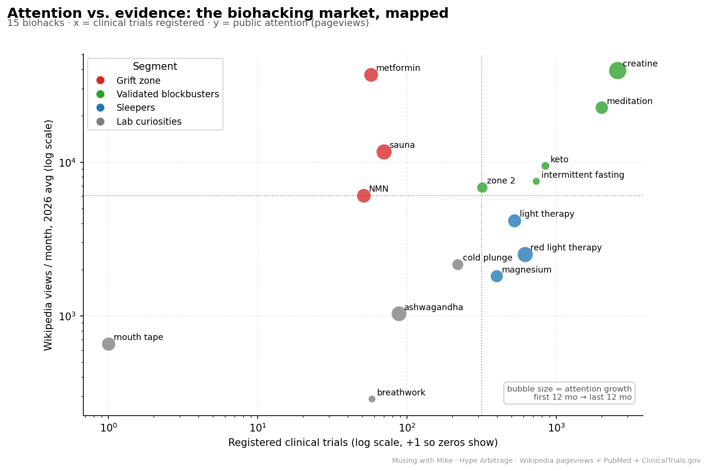
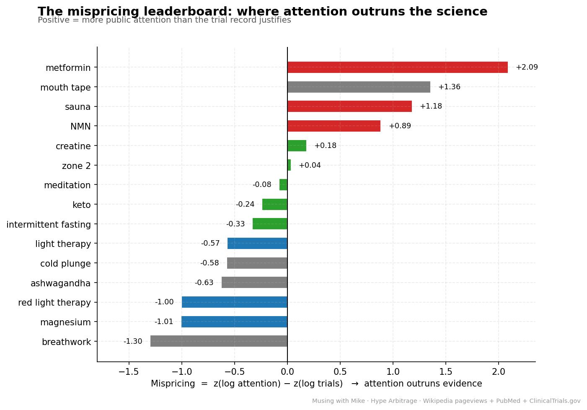
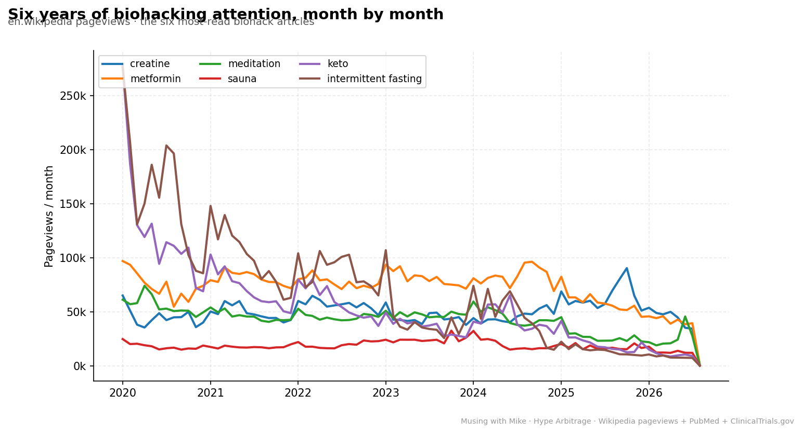
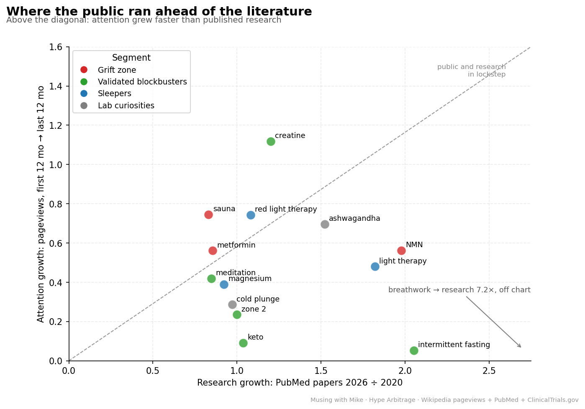
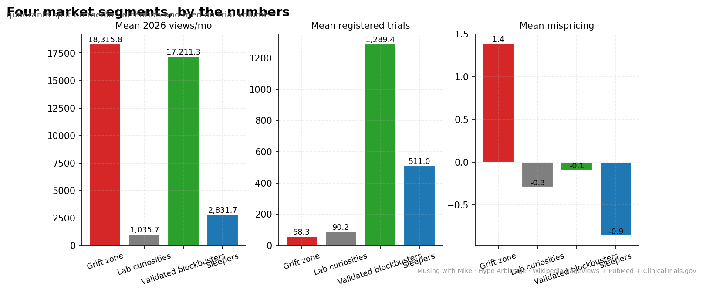

# Hype Arbitrage: Where Biohacking Attention Outruns the Evidence

**Date:** 2026-09-22 · **Topic:** biohacking · Part of the [Daily builds](https://github.com/mzhou-ds/passion-projects) series — *Musing with Mike*

I spent years at Lyft, DoorDash, and Patreon watching demand curves. Biohacking has one too — public attention. And it has a supply curve: published research and registered trials. When demand outruns supply, that's where the grift lives. When supply outruns demand, that's what's undervalued.

So I measured both. **Attention:** monthly Wikipedia pageviews for 15 biohacks, Jan 2020 → Aug 2026 (80 months, ~28M views). **Research supply:** PubMed papers per year for 16 terms via NCBI E-utilities (~54k papers). **Evidence depth:** registered clinical trials from the [2026-09-13 evidence audit](../../2026-09-13/biohacking-evidence-audit/). Then a mispricing score: `z(log attention) − z(log trials)`.

## What I built

- `src/01_fetch_pageviews.py` — Wikimedia Pageviews API → `data/pageviews_monthly.csv`, `data/attention_summary.json`
- `src/02_fetch_pubmed.py` — NCBI E-utilities yearly publication counts → `data/pubmed_yearly.csv`
- `src/03_merge_evidence.py` — joins all three sources, computes mispricing, segments into quadrants → `data/hype_evidence.csv`, `data/segments.json`
- `src/04_make_charts.py` — five charts → `charts/`
- `data/DATA_SOURCES.md` — every source, query, and caveat

## Findings

**1. The grift zone is real: sauna and NMN.** Sauna pulls ~11.7k Wikipedia views a month on 69 registered trials. NMN pulls ~6.1k/month on 50 trials. Two of the most monetized words in wellness, and the trial record is a rounding error. That's the arbitrage: sell the story, skip the science.

**2. The most "mispriced" name on the board is a mirage — and that's the lesson.** Metformin tops the mispricing chart (+2.09), but most of its 37k monthly views are diabetes patients, not biohackers. Attention proxies are noisy. I kept it in the data and flagged it rather than quietly dropping it. Bring the objection first.

**3. The sleepers: magnesium and red light therapy.** 396 and 615 registered trials, 6,655 PubMed papers for red light — and readership a fraction of sauna's. Mispricing ≈ −1.0 for both. The evidence showed up; the audience hasn't.

**4. Breathwork is the saddest chart.** Public attention down 96% since 2020. PubMed papers up 7.2×. The literature arrived after the audience left.

**5. Keto and intermittent fasting are faded blockbusters.** Attention down ~90–95% from 2020 peaks — the culture moved on. But 837 and 731 trials each: among the most validated things on the board. Fads fade; data doesn't.

**6. Creatine is the only biohack where attention grew (1.12×) — on top of the deepest evidence base (2,562 trials).** The boring answer won.

**7. Mouth tape has a Wikipedia article (created 2023), 17 PubMed papers, and zero registered trials.** Sleepmaxxing doesn't even have a Wikipedia article. Pure fringe, both of them.

**Bottom line:** attention is a demand curve and trials are the supply. Right now the market is mispriced in both directions — sauna and NMN are overbought, magnesium and red light are oversold, and breathwork is the one where the research showed up to an empty room.

## Charts







## Reproduce

```bash
pip install -r requirements.txt
python3 src/01_fetch_pageviews.py   # ~1 min, Wikimedia API
python3 src/02_fetch_pubmed.py      # ~3 min, NCBI E-utilities (≤3 req/s)
python3 src/03_merge_evidence.py    # needs ../../2026-09-13/.../trials_summary.json
python3 src/04_make_charts.py
```

## Caveats

- Wikipedia skews informational; TikTok-native fads (cold plunge, mouth tape) under-register vs. their cultural footprint.
- "Magnesium in biology" and "Aerobic exercise" capture broader readership than the supplement/zone-2 niches; metformin's views are mostly diabetes-driven.
- PubMed phrase queries are approximations; 2026 is a partial year.
- Trial counts are keyword-based upper bounds from the 2026-09-13 audit; registration ≠ publication.
- Mispricing is a relative ranking, not a truth meter. Read the caveats before citing the leaderboard.
