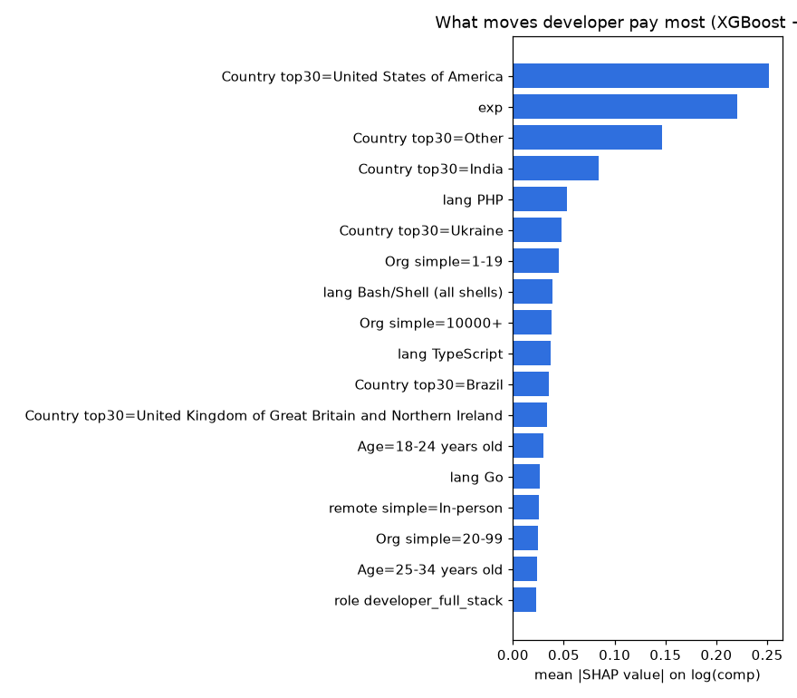
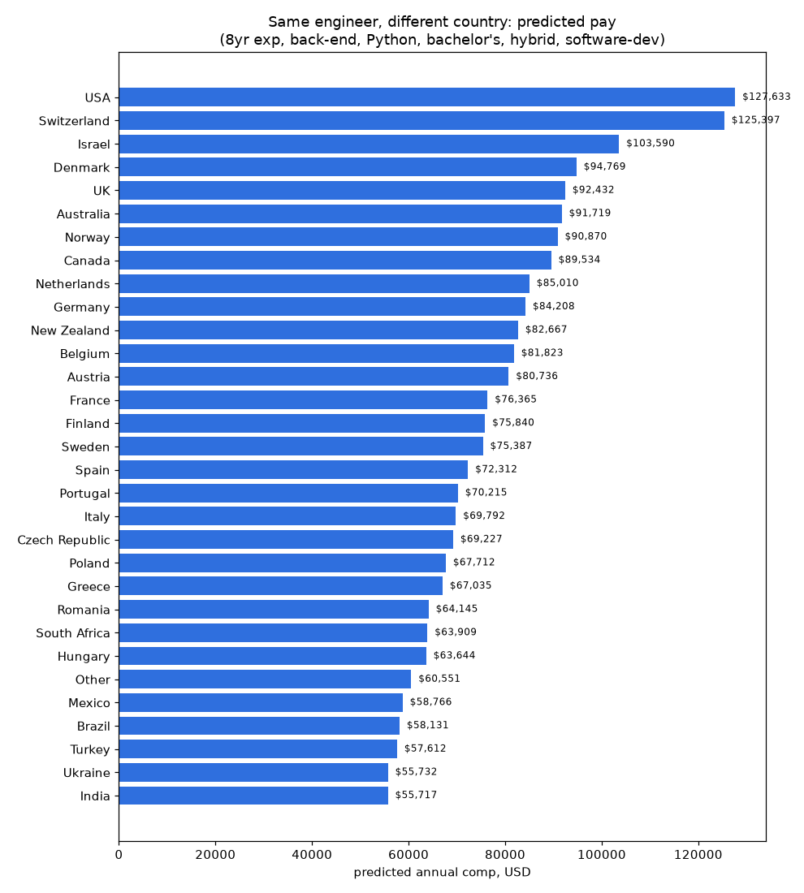
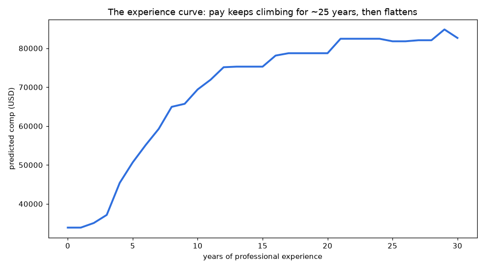
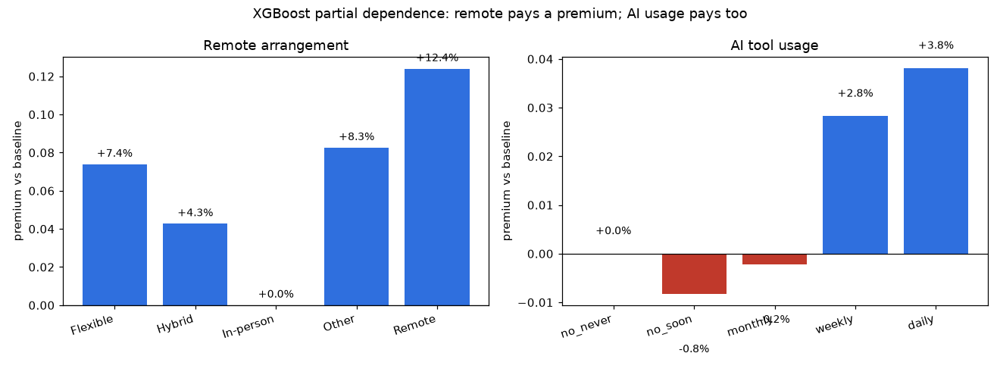

# The Hedonic Engineer: what the global developer labor market actually prices

*Daily build 2026-09-23 · topic: tech-industry · part of [mzhou-ds/passion-projects](../..)*

If developer pay is a price, it should decompose like one. This build runs a **hedonic pricing model** on 18,925 professional developers across 152 countries from the Stack Overflow 2025 Developer Survey — the same idea Airbnb uses to price a listing from its attributes: `log(pay) = f(country, experience, role, languages, remote, AI use, education, org size, industry)`.

Two models, one story: an OLS hedonic regression (R² = 0.54) for clean, citable premiums, and an XGBoost model (test R² = 0.56) with SHAP values to confirm the ranking and catch nonlinearities. Reproduce everything with `pip install -r requirements.txt && python src/01_clean.py && python src/02_hedonic.py && python src/03_xgb_shap.py && python src/04_counterfactual.py` (needs `survey_results_public.csv` from the [SO 2025 survey](https://survey.stackoverflow.co/); set `SO2025_RAW` to its path).

## The 5 findings that matter

### 1. The "remote tax" is a myth — remote carries a premium
Controlling for country, experience, role, languages, education, org size, and industry, **remote workers earn +23.6% over in-person peers**; hybrid +13.3%. Even inside the US-only subsample (n=4,156), remote pays **+6.8%**. The XGBoost partial-dependence agrees: predicted pay is highest for remote ($88k avg), lowest for in-person ($79k). Conventional wisdom says remote workers trade pay for flexibility — the market says the opposite, because remote postings compete in a global talent pool.

### 2. Geography is the single biggest pricing factor — a 2.3× gap for the same engineer
SHAP ranks `country=US` as the #1 pay driver, ahead of experience itself. For a fixed reference engineer (8 yrs exp, back-end, Python, bachelor's, hybrid, software-dev): **$127.6k in the US, $125.4k in Switzerland, $89.5k in Canada, $69.8k in Italy, $55.7k in India.** Canada prices at −35.5% vs the US after controls — the cross-border discount is real and large.

### 3. The AI-productivity premium is only ~5%
Daily AI-tool users earn **+4.9%** over non-users, weekly +4.8% — real, priced in, but tiny next to the hype. AI skill reads as table stakes, not a differentiator. (Causality caveat: early adopters skew senior.)

### 4. Size and sector are mispriced in plain sight
**10,000+ employee orgs pay +33.5%** over 20–99 person companies — startup equity has a steep cash hill to climb. **Fintech pays +23.1%**, banking +10.9%, government −6.8%. Engineering managers get +16.4% over ICs; the pure manager title premium (ICorPM) is only +3.0%, so most of it is in the role mix.

### 5. Your stack is a pay cut (or raise): Swift +13%, PHP −17%
Language premiums, additive, holding all else equal: **Swift +13.3%, Rust +9.8%, TypeScript +9.5%, Go +8.6%, Ruby +8.4%** at the top; **PHP −16.9%, Dart −10.6%** at the bottom. Education still prices: master's +7.3% over bachelor's; doctorate +7.0%.

### Bonus: the experience curve and the age paradox
Pay rises ~4.6% per year of experience at the 8-year mark and keeps climbing until ~25 years, then flattens. But **conditional on experience, older age bands earn less** (45–54: −24.8% vs 25–34). Experience pays; age doesn't — late entry or stalled progression is penalized.

## Files
- `src/01_clean.py` — sample construction (18,925 professional devs w/ valid comp)
- `src/02_hedonic.py` — OLS hedonic regression, premium tables → `data/hedonic_premiums.json`
- `src/03_xgb_shap.py` — XGBoost + SHAP, partial dependence → `data/partial_dependence.json`
- `src/04_counterfactual.py` — reference-profile geo arbitrage + US-only remote check → `data/geo_arbitrage.csv`
- `charts/` — SHAP beeswarm + importance, experience curve, remote/AI partial dependence, geo arbitrage
- `data/` — premiums JSON, arbitrage CSV, analysis sample CSV (raw survey CSV excluded: download from SO)

## Caveats
Survey self-selection (SO skews toward certain dev populations); compensation is self-reported; converted to USD at survey-time rates; premiums are conditional associations, not causal estimates. "Remote=Other" (+37%) is a small NA bucket and excluded from conclusions.
