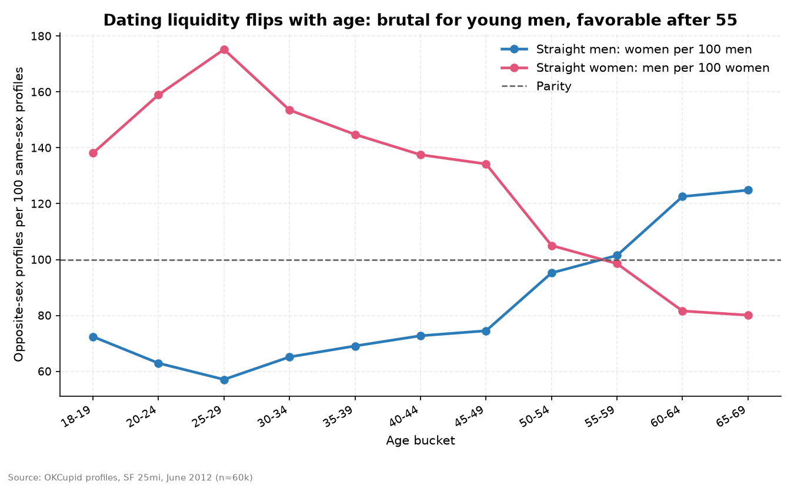
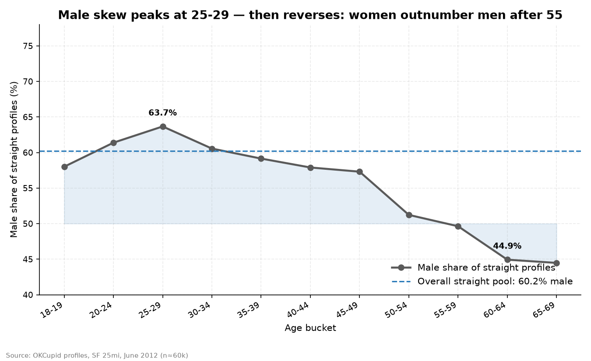
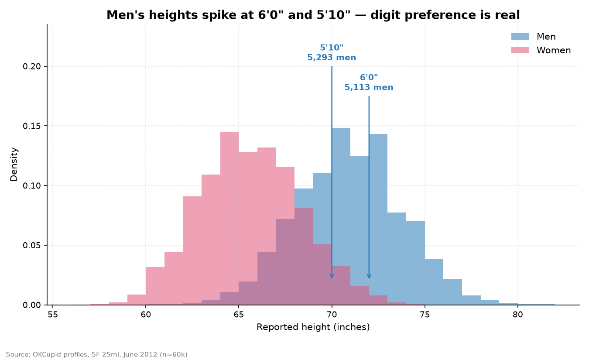
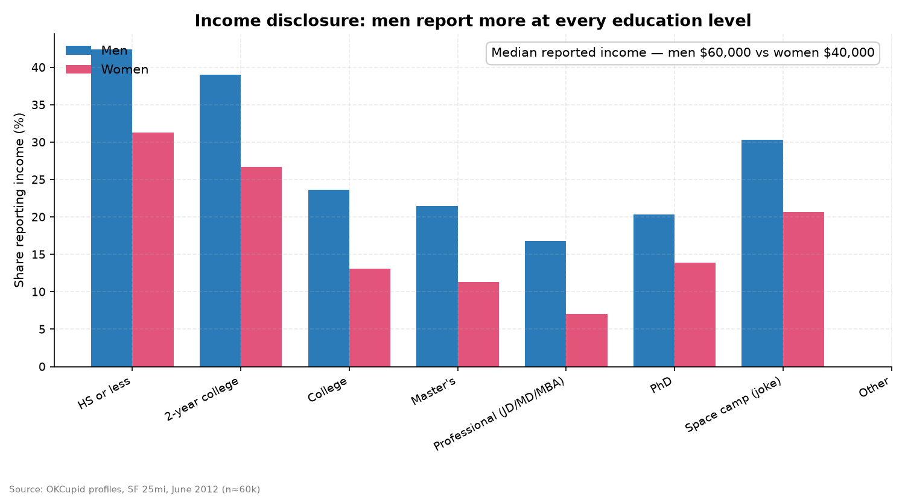
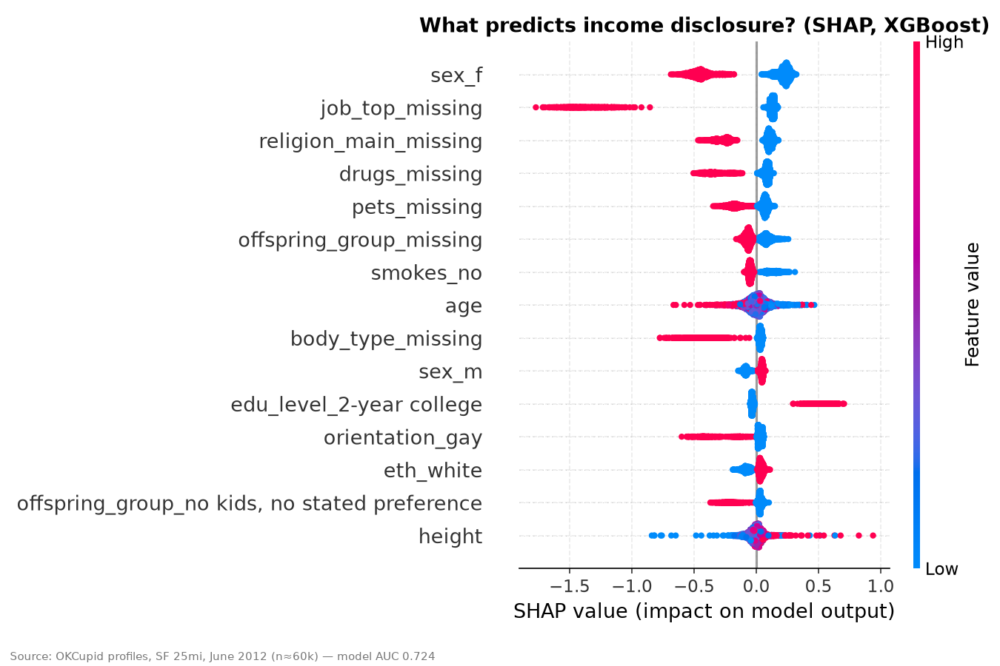
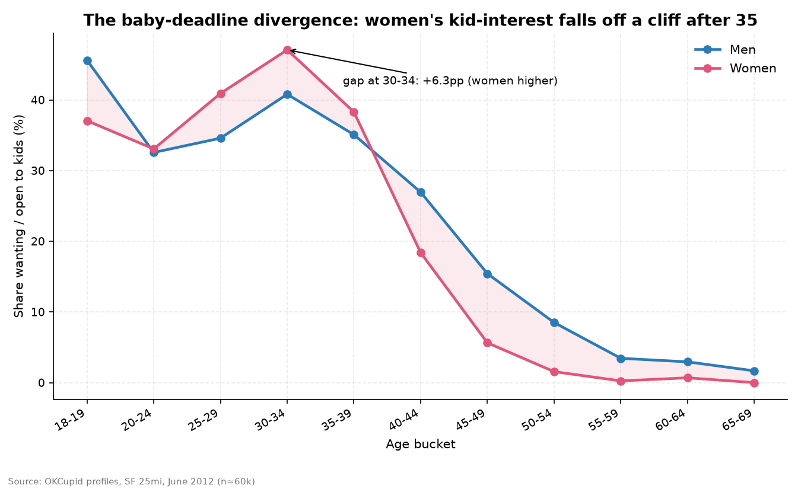
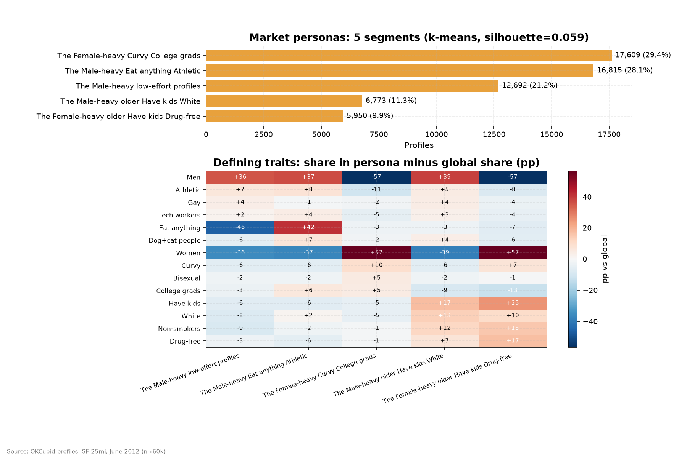

# Swipe Economics: What 60,000 Dating Profiles Reveal About the Bay Area's Mating Market

Dating apps are two-sided marketplaces. Supply imbalances. Information asymmetry. Signaling. The same mechanics as any marketplace I've worked on — just with worse photos.

So I treated 59,946 OkCupid profiles from the 2012 Bay Area as market data and ran them like an operator would: who supplies, what they disclose, where the liquidity is, and what the numbers say people actually optimize for.

## The data

- **59,946 profiles**, 25-mile radius of San Francisco, active in the year to June 2012, each with a profile photo. Scraped by Kim & Escobedo-Land (2015, *Journal of Statistics Education*); revised CSV via [rudeboybert/JSE_OkCupid](https://github.com/rudeboybert/JSE_OkCupid).
- 19 columns: age, sex, orientation, height, income (19% disclose; −1 = withheld), education, job, body type, diet, drinks, drugs, smokes, pets, religion, ethnicity, offspring, sign, speaks, status.
- Median age 30 for both sexes. 86% straight, 93% single.
- Reproduce everything: `python analysis.py` regenerates `charts/` and `findings.json` from `data/profiles_revised.csv`.

## What I found

**1. The market is 60% male — and liquidity flips with age.**
Overall: 148.6 men per 100 women (60.2% male among straight profiles). But the imbalance isn't uniform. At 25–29, a straight woman faces **175 men per 100 women** — the most lopsided cohort in the market. By 60–64 it inverts: men see **123 women per 100 men**. Same market, opposite problem, thirty years apart.

**2. The 6-foot fraud is measurable.**
14.3% of men report being exactly 72 inches — **42% more** than neighboring inches (71", 73") would predict. Another 14.8% land exactly on 70" (5'10"), 26% above expectation. In total, **36.6% of men claim 6'0" or taller**. Women round too, but milder (66" shows +8% excess). The tell that it's inflation, not a trend: men in their 20s report the *same* average height as men in their 50s (70.43" vs 70.45"). Nobody grew. Everybody rounded up.

**3. Income disclosure is a costly signal — and it's gendered.**
Only 19% of profiles disclose income. Men disclose at **23.4% vs 12.9% for women** — nearly 2× at *every* education level. Median reported: $60k men vs $40k women. Meanwhile women are *more* credentialed: 82% hold college+ degrees vs 76% of men. The women in this market out-educate the men and under-disclose their earnings.

I trained an XGBoost classifier to predict who discloses income (AUC 0.72, honest train/test split). SHAP says the top predictor isn't education or job prestige. It's whether you bothered to fill in your job field at all — followed by skipping religion, drugs, and pets. **Disclosure proxies for profile conscientiousness, not earnings.** The people who tell you their income are the people who fill out forms completely.

**4. The credential premium has a PhD discount.**
Median reported income by education: Master's $80k = JD/MD/MBA $80k > **PhD $70k** > college $50k > high school $30k. The PhD earns less than the MBA on a dating profile, just like everywhere else. Academia: the original underpaid prestige market.

**5. The baby-deadline crossover.**
Among profiles that answer the kids question (only 41% do): at 30–34, **47% of women vs 41% of men** want or are open to kids. By 40–44 it flips — **27% of men vs 18% of women**. Women's kid-interest falls off a cliff after 35–39 (38% → 18% → 6%). Men hedge: they're more likely to say "might want kids" (18% vs 14%) while women are more likely to already have them (25% vs 18%).

**6. One-fifth of the market is ghosts.**
K-means on profile features (k=5, picked by silhouette) finds five personas — and the third-largest is **"low-effort profiles": 21% of all profiles**, 95% male, where 93.5% skip diet, 83% skip the kids question, and half skip pets. A fifth of supply is near-empty listings. Every marketplace has ghost inventory. This one lists it under "athletic."

The other four: female-heavy curvy college grads (29%), male-heavy eat-anything athletic types (28%), older men with kids (11%, avg age 47), older women, drug-free (10%, avg age 47).

## The operator takeaways

- **Liquidity is the whole game.** The tightest market in the Bay Area in 2012 was women aged 25–29 (175:100). The loosest was men over 60. Age is the dominant pricing variable.
- **Verification beats self-report.** A third of men claim 6'0"+. Any marketplace running on unverified attributes gets gamed at the round numbers. (Dating apps later learned this; so did every gig platform.)
- **Disclosure is a signal about the discloser.** Income on a profile tells you less about the income than about the person. Conscientiousness is the real feature — it just doesn't fit in a text box.
- **Ghost inventory is real.** 21% of listings are near-empty. Marketplaces don't just have a demand problem; they have a dead-listing problem.

## Try it: the Dating Market Calculator

Open `calculator.html` in a browser. Enter age, sex, height, education, and income — it tells you your percentile in the 2012 SF pool and how tight your age cohort's market was. Pure HTML/JS, no backend.

## Limits (read before citing)

- San Francisco, 25-mile radius, **June 2012** — a historical snapshot, not today's market and not other cities.
- Self-reported: height and income show digit preference and likely inflation (max reported income: $1,000,000, presumably a joke).
- Income disclosed by only 19% (skews toward higher earners); kids question answered by only 41%.
- All claims correlational. Personas are soft clusters (silhouette 0.059), honestly reported — descriptive segments, not personality types.
- Aggregate analysis only. No individual profiles are surfaced anywhere in this project.

## Files

- `analysis.py` — full reproducible pipeline (pandas, matplotlib, scikit-learn, XGBoost + SHAP)
- `data/profiles_revised.csv` — source data (13 MB)
- `charts/` — 8 charts
- `findings.json` — every headline number, machine-readable
- `calculator.html` — interactive market calculator
