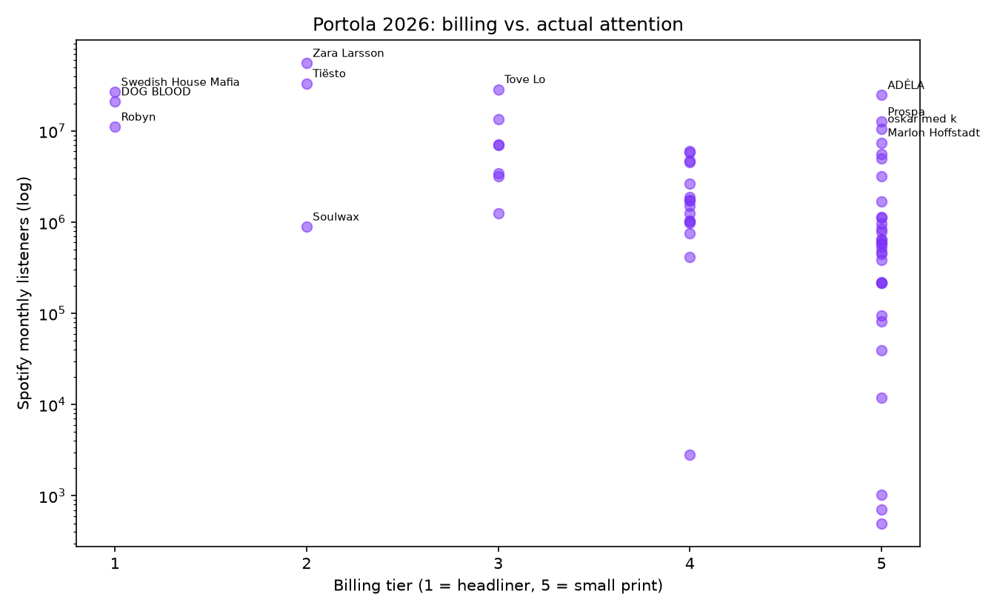
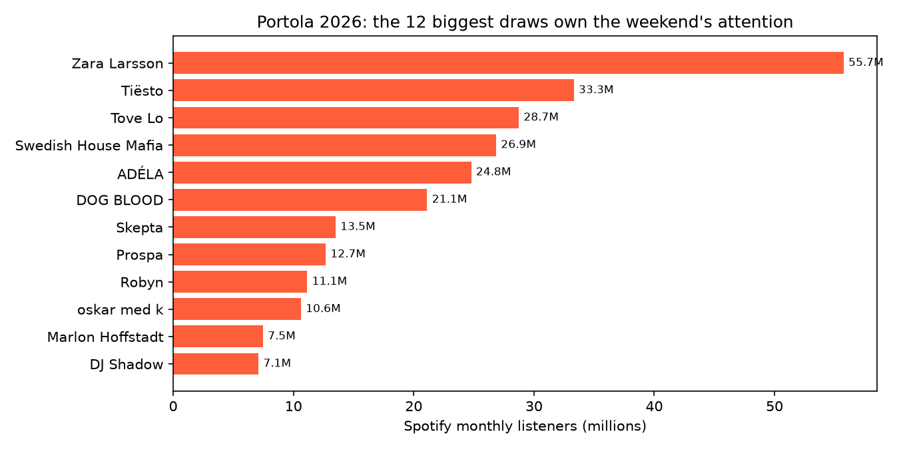
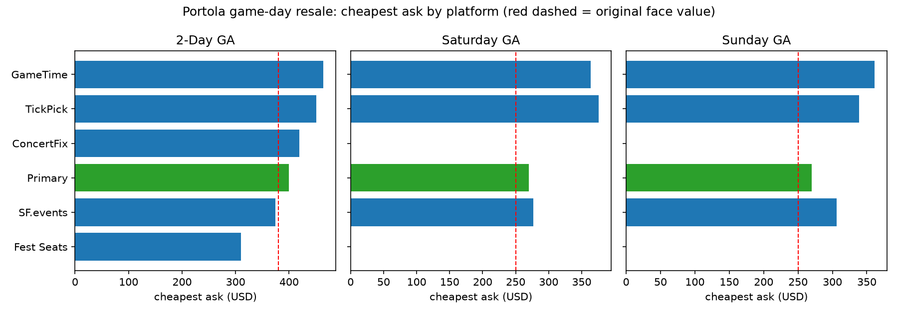

# The Portola Playbook: Who's Worth Your Hours, and What the Ticket Should Cost

**Build #19** · 2026-09-26 · part of the [passion-projects](../../README.md) daily series

Portola 2026 runs today and tomorrow at Pier 80. So this build is a working
document, not a retrospective: the full 63-artist lineup scored by real
attention data (Spotify monthly listeners, pulled this morning), cross-checked
against what's actually charting on Beatport right now, run through a schedule
optimizer to produce the highest-value itinerary for each day, and priced
against this morning's resale market across five platforms.

## Key findings

1. **The lineup's attention is absurdly concentrated — and mispriced.** The
   63 artists combine for ~309M Spotify monthly listeners, but the top 5 own
   55% of it and the top 10 own 73%. Billing doesn't track attention: ADÉLA
   (24.8M listeners, the 5th-biggest draw on the entire bill) is in the
   small print on Sunday's Crane stage at 3:50 PM. Prospa (12.7M), oskar med k
   (10.6M), Marlon Hoffstadt (7.5M) and nimino (5.0M) are all buried in tier
   4–5 billing despite top-20 attention. The cheap alpha of the weekend is in
   the small print.

2. **Zara Larsson is the most under-billed artist at the festival.** 55.7M
   monthly listeners — nearly double the next act, more than Robyn and
   Swedish House Mafia combined — playing second-from-top on Sunday's Pier
   stage. She goes 7:05–8:05 PM directly against Tiësto (33.3M) in the
   Warehouse. That is the single costliest conflict of the weekend: you cannot
   see both, and together they hold 48% of the entire Sunday bill's Spotify
   attention — nearly half the day's draw in one overlapping hour.

3. **The optimal Saturday is a Pier stage lock-in; the optimal Sunday forces
   one brutal choice.** Weighted interval scheduling over the official set
   times (weight = monthly listeners × set length) captures 55% of Saturday's
   total attention and 61% of Sunday's with zero walking:
   - *Sat:* Sam Alfred → MGNA Crrrta → oskar med k → Fcukers → Tove Lo →
     Robyn → DOG BLOOD (all Pier except the first two)
   - *Sun:* Dean Turnley → Silva Bumpa → ADÉLA → SG Lewis → Marlon Hoffstadt
     → Zara Larsson → Swedish House Mafia (then choose: Tiësto *or* Zara)
   The other defining conflicts: Robyn vs KETTAMA (55 min, Saturday) and
   Parcels vs Four Tet (75 min, Sunday close).

4. **Game-day resale is inverted: the primary market undercuts it.** Face was
   $379.95 for 2-day GA; the official site was still selling 2-day GA at
   $399.95 as of Sep 18. This morning's cheapest resale asks: $451 all-in on
   TickPick, $464 all-in on GameTime — 19–22% *above* face. Single days are
   worse: Saturday GA (face $249.95) asks $364–376 on the big platforms,
   +46–50%. The only below-face ask anywhere is a $310 2-day on Fest Seats
   (fees added at checkout), and the price spread across platforms is 50% for
   the same ticket. If you don't have a ticket yet: check primary first, then
   the aggregators — not the big all-in apps.

5. **Thirteen lineup artists are on Beatport's Top 100s right now.**
   KETTAMA charts in five of six genre charts; Brunello in four; Prospa,
   Max Styler, Silva Bumpa, Mochakk, Marlon Hoffstadt and Swedish House Mafia
   also charting. The DJ-cred heat and the Spotify attention agree on Prospa,
   KETTAMA, Marlon Hoffstadt and Silva Bumpa — four names the poster buries.

6. **Skepta is on the poster but not on the schedule.** Skepta (13.5M monthly
   listeners, the 6th-biggest draw) appears in the May lineup announcement
   and every press rundown, but has no set time on either official set-time
   poster and is absent from the festival's current lineup page. No
   cancellation has been announced. Either a quiet dropout or the
   best-advertised scheduling error of the year — worth checking the
   festival's channels before banking Saturday plans around it.

## The four analyses

### 1. The lineup, scored (Spotify, Sep 26 2026)

Every artist's Spotify page was resolved this morning via the Spotify API
(`data/spotify_listeners.json`; 60 of 63 resolved — DESPACIO is a
soundsystem, Mike D 5D and Kaytree have no artist pages yet, basspunk. has
none). DOG BLOOD's duo page (126K) understates the live draw, so the
scheduling math uses Skrillex's 21.1M as the conservative effective draw,
flagged in the data.




### 2. The schedule optimizer

Official set times from portolamusicfestival.com/set-times/
(`data/schedule.csv`, 63 slots across Pier, Crane, Warehouse, Ship Tent and
Despacio). Weighted interval scheduling (dynamic programming, exact optimum)
maximizes listener-minutes per day with no overlaps. Full itineraries in
`data/summary.json`.

### 3. The game-day resale market

Cheapest asks scraped the morning of Sep 26 across GameTime (all-in),
TickPick (no-fee, all-in), Fest Seats, ConcertFix and the san-francisco.events
aggregator, vs $379.95 / $249.95 face and current primary pricing
(`data/resale_prices.csv`).



Take-rate note: GameTime and TickPick show all-in prices; StubHub-style
platforms (blocked to scrapers; Vivid Seats bot-walled) typically add
~20–30% in buyer fees at checkout, so aggregator asks understate true cost
while all-in asks don't. Either way, the ranking holds: primary ≈ cheapest,
then aggregators, then the all-in apps.

### 4. The value math

$379.95 ÷ 63 sets ≈ **$6 per set** at face. See 12 sets across the weekend
and you're paying ~$32 per set — under a typical SF club-night cover
($40–60) for a much bigger room. The 2-day pass only makes sense if you go
both days, though: at today's resale asks, two single days ($364 + $361 on
GameTime) cost more than the 2-day ($464), but at face the singles
($249.95 × 2 = $499.90) cost *more* than the 2-day ($379.95) — the bundle
discount is ~24%.

## Reproduce

```bash
python3 src/make_lineup.py        # lineup -> data/lineup.csv
python3 src/fetch_spotify.py      # Spotify monthly listeners (needs `spotify-api` CLI)
python3 src/fetch_beatport.py     # Beatport Top 100s -> data/beatport_tracks.csv
python3 src/make_schedule.py      # official set times -> data/schedule.csv
python3 src/make_resale.py        # game-day resale snapshot -> data/resale_prices.csv
python3 src/analyze.py            # everything -> figures/, data/summary.json
```

## Sources

- Lineup + set times: https://portolamusicfestival.com/lineup/ and
  https://portolamusicfestival.com/set-times/ (read 2026-09-26)
- Lineup announcement: Consequence, BrooklynVegan, JamBase (May 28, 2026)
- Current primary pricing: Magnetic Magazine (Sep 18, 2026)
- Resale: GameTime, TickPick (event IDs 8038426/8038427/8038428), Fest Seats,
  ConcertFix, san-francisco.events (scraped 2026-09-26 AM PT)
- Spotify monthly listeners via connected Spotify API; Beatport charts via
  embedded page data (both pulled 2026-09-26)
