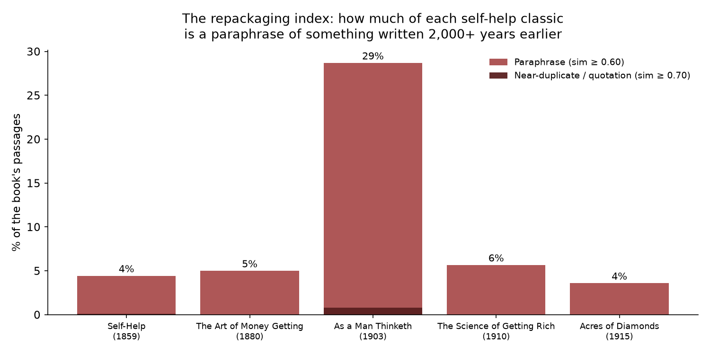
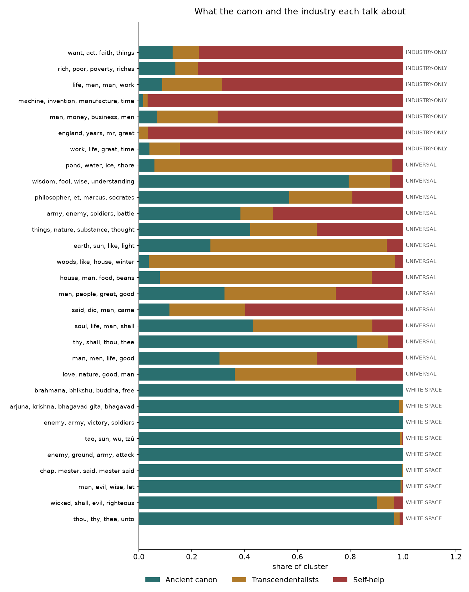

# The Self-Help Industry Is Selling You the Tao Te Ching at $27.99

*An embedding-based audit of the wisdom supply chain: how much of classic self-help is paraphrased ancient scripture, what the industry actually invented, and which 2,000-year-old ideas were never productized at all.*

**Corpus:** 9,224 passages from 15 public-domain texts on three shelves —
the ancient canon (Tao Te Ching, Analects, Dhammapada, Bhagavad Gita, Art of War,
Proverbs, Ecclesiastes, Meditations), the transcendentalists (Emerson's *Essays*,
Thoreau's *Walden*), and the self-help classics (Smiles's *Self-Help* 1859,
Barnum's *The Art of Money Getting* 1880, Allen's *As a Man Thinketh* 1903,
Wattles's *The Science of Getting Rich* 1910, Conwell's *Acres of Diamonds* 1915).
All from Project Gutenberg; passage-level CSV in `data/corpus.csv`.

**Method:** every passage embedded with `all-MiniLM-L6-v2` (sentence-transformers,
384-dim, L2-normalized); cosine similarity throughout. Similarity thresholds were
*calibrated by hand-reading pairs* at each band: ≥0.60 reads as the same idea
reworded; ≥0.70 reads as close paraphrase or direct quotation; below 0.60 is
same-theme-different-idea. Details in [Method](#method).

---

## The question

The self-help industry is worth somewhere north of $10 billion a year. Its
founding texts — the ones every modern guru is remixing — were written between
1859 and 1915. And a persistent suspicion hangs over all of them: *is any of
this actually new?*

I wanted to price the suspicion.

## Finding 1: The repackaging index

For every passage in each self-help classic, I found its closest match in the
ancient canon and measured the similarity. The share of each book scoring
≥0.60 — the same idea, reworded — is its **repackaging index**:



- ***As a Man Thinketh* (1903): 28.7% paraphrase.** More than one passage in
  four is a reworded Buddha, Solomon, or Marcus Aurelius. The book's thesis —
  "as a man thinketh in his heart, so is he" — is Proverbs 23:7, quoted in
  the title. Its opening poem versifies the Dhammapada's first verse.
- *The Science of Getting Rich* (1910): 5.7%. *The Art of Money Getting*
  (1880): 5.0%. *Self-Help* (1859): 4.5%. *Acres of Diamonds* (1915): 3.6%.

So what: the founding document of the "mindset" genre is roughly one-quarter
recycled scripture. The industry's originality was never evenly distributed —
one book did the paraphrasing, the rest did something else (see Finding 2).

The ≥0.70 band — near-duplicate or direct quotation — is rarer but blunter.
Smiles quotes Proverbs 22:29 *verbatim, with attribution* ("Seest thou a man
diligent in his business? he shall stand before kings"). Barnum quotes
Proverbs 10:4 ("He becometh poor that dealeth with a slack hand"). They weren't
hiding the sourcing. They were laundering it: scripture in, advice out, and
the authority transferred from Solomon to the author.

Browse the hand-verified evidence: **[pairs.html](pairs.html)**.

## Finding 2: What the industry actually invented wasn't ideas — it was packaging

KMeans over all 9,224 passages (k=30) finds the clusters the self-help shelf
dominates. They are not idea clusters. They are *format* clusters:

- **The biographical case study** (Smiles): "life, work, great, did, time" —
  373 of 444 passages from *Self-Help*. Smiles's innovation was narrative, not
  philosophical: hundreds of lives of engineers, inventors, and artists as
  proof-by-anecdote.
- **The industrial sublime** (Smiles): "machine, invention, manufacture,
  jacquard" — the steam engine as moral exemplar.
- **Wealth mechanics** (Wattles/Barnum): "rich, getting rich, money, dollars,
  debt" — the first shelf in the corpus that talks about money as a *system*
  rather than a temptation.
- **New Thought action** (Allen/Wattles): "want, act, business, purpose,
  faith" — thought as a causal force you operate like machinery.

So what: the moat was never the ideas. It was **packaging and distribution** —
biography as evidence, wealth as the promise, and the author as the authority
figure replacing the sage. A marketplace lens: the canon supplied the
inventory (open-source, 2,000 years old); the industry built the storefront.

## Finding 3: The universal core — what 5+ civilizations independently discovered

For each canon passage I counted how many *other traditions* contain a passage
at similarity ≥0.55 — its **resonance**. Most wisdom is tradition-local (2,665
canon passages resonate with zero other traditions). But 9 passages resonate
across **5 or more traditions** — the inner core humanity kept rediscovering:

| Idea | Example |
|------|---------|
| Non-striving wins | Tao Te Ching: "Because he does not strive, no one finds it possible to strive with him" |
| Knowledge as the highest good | Gita / Proverbs / Meditations / Analects / Dhammapada converge on knowing |
| Pride falls, humility stands | Proverbs 29:23: "A man's pride shall bring him low: but honour shall uphold the humble in spirit" |
| Honor your nature's work | Meditations: the mechanic honors his trade, the dancer his art — do you honor your nature less? |
| Death, the leveler | Meditations XXXVI on mortality |

So what: strip away 2,500 years of branding and the surviving SKUs are
embarrassingly few — don't force it, know things, stay humble, do your work,
remember you die. Everything else is commentary.

## Finding 4: The white space — the arbitrage

The clusters the canon dominates and the industry never touched (≤8% self-help
share) are the **unproductized ideas**. The pattern is sharp: the industry
took the *practical-ethical* layer (diligence, character, thought-control) and
left the *metaphysical* layer on the table:

- **The Taoist metaphysical core** — the strategist/taoist cluster on wu-wei,
  non-action, and the way of things carries a 1% self-help share. Fragments of
  Taoist thought surface elsewhere, but the Tao Te Ching as a philosophy of
  non-striving was never given the *Art of War* business-book treatment.
- **Non-self / the brahmana ideal** — the Dhammapada's psychology of
  self-dissolution; untouched.
- **Dharma and duty without reward** — the Gita's nishkama karma; the industry
  kept "duty" but deleted "without reward."
- **Memento mori** — Marcus's mortality meditations; the Stoic cluster the
  industry never stocked (modern Stoicism-bro culture arrived a century late).
- **Wisdom-vs-folly as epistemology** — Proverbs' theory of knowledge; the
  industry took the proverbs and skipped the epistemology.

So what: this is the actual arbitrage table. Each of these ideas has 2,000+
years of product-market fit, canonical authority, and *no modern bestseller
built on it*. If you wanted to start a wisdom brand tomorrow, you wouldn't
repackage diligence for the hundredth time — you'd productize wu-wei.



## The deliverables

- **`wisdom.py`** — semantic search over all 9,224 passages. Ask it a question
  in plain words; it answers with the most relevant passage from each shelf:
  `python3 wisdom.py "how do I deal with a difficult coworker"`
- **[explorer.html](explorer.html)** — the Wisdom Atlas: every passage mapped
  by meaning (UMAP), click any dot to read it, keyword search included.
- **[pairs.html](pairs.html)** — the hand-verified paraphrase gallery.

## Method

1. **Corpus** (`src/build_corpus.py`): Gutenberg texts stripped of headers,
   split into paragraphs (long ones chunked at sentence boundaries, ≤550
   chars), filtered to 40+ chars / 8+ words. Translator footnotes (Long's
   Meditations notes, Giles's *Art of War* commentary/introduction, book
   indexes, CJK-untranslated Analects spans) removed. 15 works → 9,224
   passages, `data/corpus.csv`.
2. **Embeddings**: `sentence-transformers/all-MiniLM-L6-v2`, normalized;
   KJV verse numbers stripped pre-embedding so numbering can't drive matches.
   Cached in `data/embeddings_st.npz`.
3. **Repackaging index** (`src/analyze.py`): max cosine sim of each self-help
   passage against the canon; book-level rates at calibrated thresholds.
   Thresholds set by reading ~20 pairs per band (see `data/calibration_pairs.json`).
4. **Pair mining**: mutual top-5 cross-shelf neighbors, deduped, then
   hand-read; 12 kept in `data/verified_pairs.json` → `pairs.html`.
5. **Clustering**: KMeans k=30 on embeddings; labels from in-cluster mean
   TF-IDF terms; representative = nearest to centroid.
6. **Resonance**: for each canon passage, distinct other traditions with a
   passage at sim ≥0.55.
7. **Projection**: UMAP (cosine, n_neighbors=30) → `figures/fig1_umap.png`,
   `explorer.html`.

## Caveats

- **Translator confound.** Legge translated both the Tao and the Analects;
  Müller, Arnold, and Long are all Victorian Englishmen. Some cross-tradition
  similarity is shared translator diction, not shared thought. The quotation
  pairs (verbatim matches) are immune to this; the paraphrase rates are not,
  and should be read as upper bounds.
- **Thresholds are judgment calls**, calibrated by reading, not derived. Move
  0.60 to 0.65 and the repackaging indices roughly halve; the *ranking* of
  books is stable.
- **Passage chunking** splits some long arguments mid-thought; the gallery
  pairs were read in full to compensate.
- MiniLM is a small model with modern-English training data; archaic diction
  ("thou", "hath") systematically depresses some canon-canon similarities.

## Reproduce

```bash
pip install -r requirements.txt   # use a CPU torch: pip install torch --index-url https://download.pytorch.org/whl/cpu
python3 src/build_corpus.py       # fetch-free: texts ship in data/texts/
python3 src/analyze.py --backend st
python3 src/figures.py
python3 src/explorer.py
python3 src/gallery.py
python3 wisdom.py "what should I do when everything goes wrong"
```

## Sources

All texts public domain via Project Gutenberg: #216 (Tao Te Ching, Legge),
#4094 (Analects, Legge), #2017 (Dhammapada, Müller), #2388 (Bhagavad Gita,
Arnold), #132 (Art of War, Giles), #10 (KJV Proverbs & Ecclesiastes), #2680
(Meditations, Long), #2944 (Emerson Essays), #205 (Walden), #935 (Smiles),
#8581 (Barnum), #4507 (Allen), #59844 (Wattles), #34258 (Conwell).
Embeddings: `sentence-transformers/all-MiniLM-L6-v2`.
