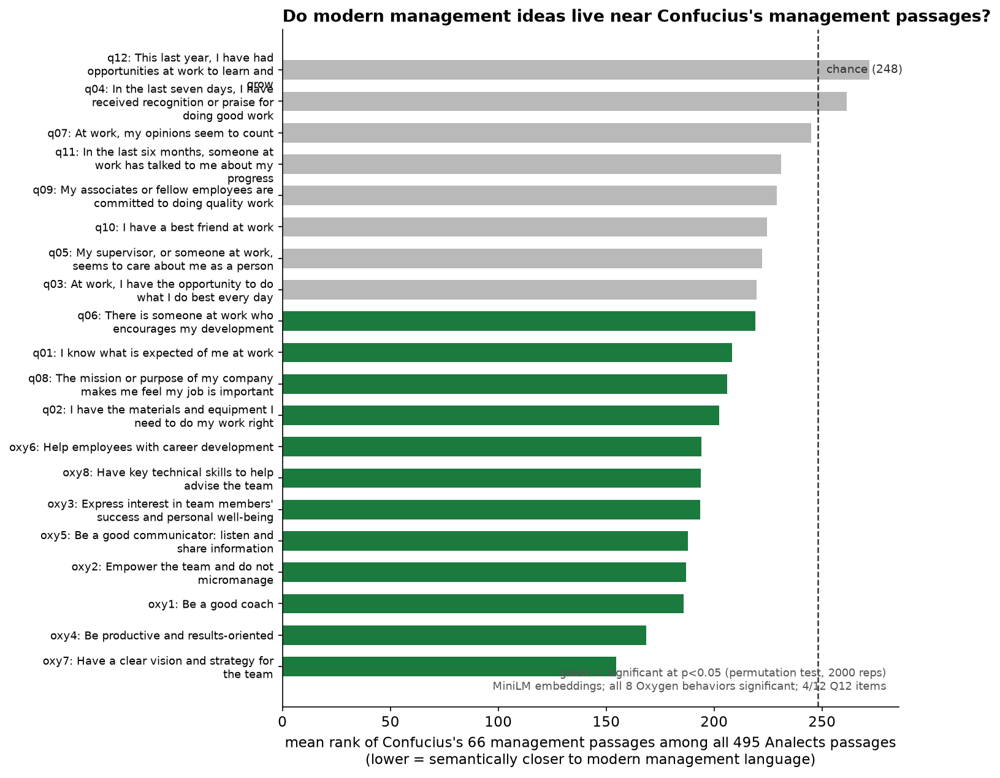
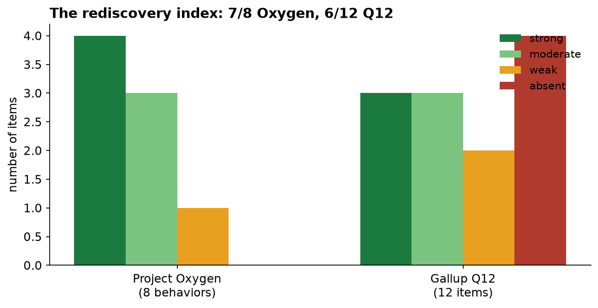
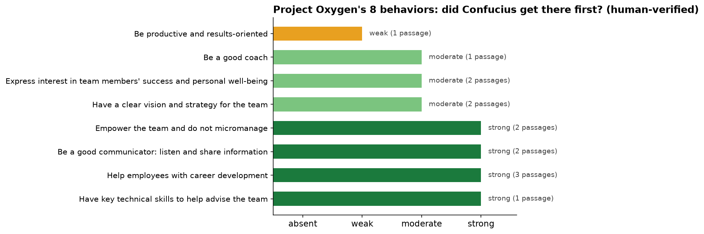
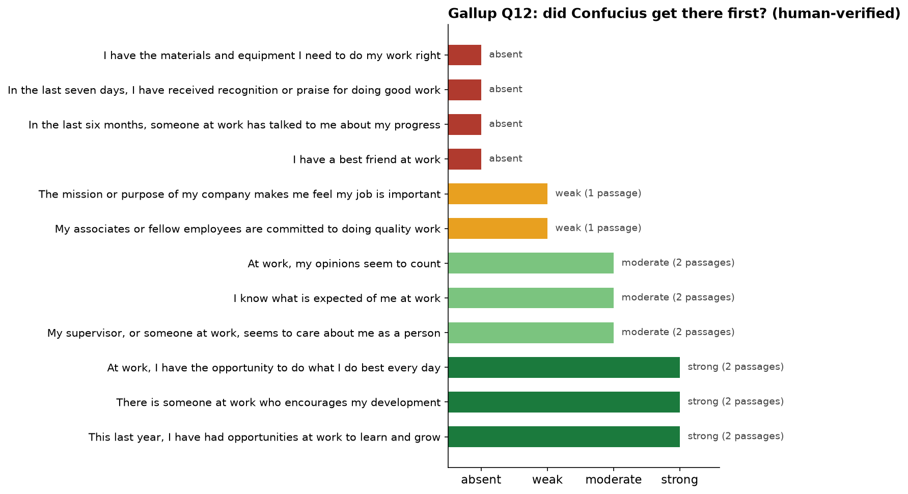

# Google's 8 Rules of Management Are 2,500 Years Old

*I fact-checked modern people science against the Analects. Confucius got 7 out of 8.*

**Corpus:** 66 hand-verified management passages from the *Analects* (James Legge translation, Project Gutenberg #4094), extracted from 495 English passages. **Modern shelf:** Google's Project Oxygen 8 behaviors of great managers (2009–2011) and Gallup's Q12 engagement items — 20 statements total, paraphrased from the public record. **Method:** MiniLM embeddings, a permutation enrichment test, and human verification of every claimed pair. Browse them: **[pairs.html](pairs.html)**.

---

## The question

In 2009, Google did something very Google: it ran people analytics on its own managers. Thousands of performance reviews, feedback surveys, and attrition numbers went in. Eight behaviors of great managers came out. Project Oxygen. It worked — manager quality measurably improved, and Google published the list.

Meanwhile, in roughly 500 BC, a guy in the state of Lu was answering the same questions from visiting dukes. "How do I get people to follow me?" "Who should I promote?" "What ruins a country?" His students wrote the answers down. We call it the *Analects*.

I wanted to know how much of Google's expensive, data-driven answer was already sitting in the cheap, 2,500-year-old one.

## Finding 1: 7 out of 8. The enrichment test says it's real, not vibes.

First the statistics, because "these feel similar" is not a finding. I embedded all 495 Analects passages and the 20 modern statements, then asked: do the 66 management passages rank systematically closer to modern management language than the other 429? Permutation test, 2,000 reps.

All 8 Oxygen behaviors: significant. 4 of 12 Q12 items: significant. Median rank of the management passages: 207 out of 495 against a chance of 248.



Then I did what the embeddings couldn't: I read everything and hand-verified every match. The machines are bad at this — Victorian translation versus HR-speak is a rough neighborhood, and generic virtue passages act as semantic hubs. So every pair below survived a human reading.

The rediscovery index: **7 of 8 Oxygen behaviors** have a genuine Confucian precedent (4 strong, 3 moderate). **6 of 12 Q12 items** do (3 strong, 3 moderate). 13 out of 20.



## Finding 2: The hits are uncomfortably specific

A few of these stopped me cold:

**"Empower your team and don't micromanage"** → *"Tan-t'ai Mieh-ming never comes to my office, except on public business."* (VI.XII). That's not a principle. That's a portrait of the empowered employee — the guy so trusted he never needs a check-in. Confucius is bragging about him.

**"Help employees with career development"** → *"Advance the good and teach the incompetent."* (II.XX). Four words of Legge's English. Google needed a whole behavior.

**"Be a good communicator — create space for dissent"** → *"If a ruler's words be not good, and no one opposes them, may there not be expected from this one sentence the ruin of his country?"* (XIII.XV). Plus: *"Do not impose on him, and moreover withstand him to his face."* (XIV.XXIII). Upward candor, 500 BC.

**"Do what you do best every day"** (Q12, strengths-based roles) → *"In his employment of men, he uses them according to their capacity."* (XIII.XXV). And the kicker: *"He does not seek in one man talents for every employment."* (XVIII.X). The full-stack-employee fallacy, retired in antiquity.



## Finding 3: The misses are the real story

Confucius whiffed on four Q12 items completely: having the materials and equipment to do the job, receiving recognition or praise, having a best friend at work, and getting progress reviews.

Look at that list. Every miss is about the *employee's experience*. Every hit is about the *leader's character*. Confucius wrote a manual for rulers, not an engagement survey for the ruled. He never once considers what it feels like to *be managed*. The resourcing duty, the praise ritual, the work friendship, the career conversation — the entire modern apparatus of making work feel good — is absent.

That's the gap 2,500 years bought us. Not better theories of leadership. The invention of the employee as someone whose experience matters.



## Finding 4: Both of them ranked technical skill last

This is my favorite result. Project Oxygen's most famous punchline: technical skill — the thing Google managers spent most of their time on — ranked *dead last* of the eight behaviors. Laszlo Bock: "it turns out that's absolutely the least important thing."

Confucius, asked whether the superior man needs broad technical ability: *"Must the superior man have such variety of ability? He does not need variety of ability."* (IX.VI)

Two completely different epistemologies — one ran regressions on performance reviews, the other ran a school in Lu — and they converged on the same ranking. The least important thing a leader can be is the best individual contributor in the room.

## Finding 5: Five ideas Google never productized

Running the comparison in reverse — Confucian management ideas with *no* modern equivalent — turned up the stuff I'd actually steal:

1. **The 2,500-year-old toxic-manager taxonomy** (XX.II). Four bad things: punishing people you never trained (cruelty), demanding the full workload suddenly with no warning (oppression), issuing lax orders then enforcing them with severity (injury), and being stingy with rewards ("acting the part of a mere official"). Every bad manager I've ever seen is exactly one of these four.

2. **Wind and grass** (XII.XIX). Culture doesn't follow the handbook. It follows what the leader *visibly desires*. "The relation between superiors and inferiors is like that between the wind and the grass. The grass must bend, when the wind blows across it." Every culture deck is downstream of this sentence.

3. **Adversarial calibration** (XIII.XXIV). Don't trust universal approval *or* universal hatred. The read that matters: the good in the neighborhood love him, and the bad hate him. Approval from the wrong people is a contra-indicator. Nobody's 360 works this way. It should.

4. **Salary-shame as a selection filter** (XIV.I). "When good government prevails in a state, to be thinking only of salary — this is shameful." Intrinsic motivation, used not as engagement fluff but as a criterion for who gets the job.

5. **Retention through contented repose** (XVI.I). Rulers shouldn't worry that their people are few, but that they don't *keep their places* — that people aren't settled, fitted, at ease. "Attract the remote with civil culture and virtue, and make them contented and tranquil." No perks. No comp bands. Fit and ease.

Browse all twenty verdicts and the five unrediscovered ideas: **[pairs.html](pairs.html)**.

---

## Method

**Corpus construction.** Downloaded Legge's *Analects* (PG #4094), extracted 495 English passages, keyword-filtered to 222 candidates, and hand-read every one. Kept 66 that give advice on governing, employing, instructing, evaluating, or managing people — each with a curator label. Passage-level TSV in `data/leadership.tsv`.

**Modern shelf.** The 8 Oxygen behaviors (order of importance per Google's published list) and the 12 Q12 items, paraphrased by me from the public record into plain behavioral descriptions. Early versions kept collapsing in embedding space under shared boilerplate ("a good manager…"), so I rewrote them as bare behavioral statements. `data/modern.tsv`.

**Embeddings.** `all-MiniLM-L6-v2` (384-dim, L2-normalized, cosine). Tried TF-IDF/LSA first — it failed on the cross-register vocabulary gap, so those results were discarded.

**Enrichment test.** For each modern statement: rank all 495 Analects passages by similarity, take the mean rank of the 66 management passages, and compare against 2,000 random 66-subsets (permutation p-value). A naive best-match comparison is biased by set size (max over 429 beats max over 66 by chance); the rank test is the fair version.

**Adjudication.** Embeddings retrieved candidates; a human (me, having read the corpus) assigned every verdict. Bands: *strong* = same idea; *moderate* = same move in a different idiom; *weak* = partial; *absent* = no precedent in the corpus. I report this plainly because the raw cosine values (0.1–0.4) are modest — this is a hard cross-millennia matching task, and the numbers alone would mislead in both directions.

**Limitations.** Legge's Victorian English is one lens on Confucius; a different translation shifts the embeddings. The modern statements are my paraphrases. The verdicts are judgment calls — the pairs page shows my work. The enrichment test measures semantic proximity, not idea identity.

## Sources

- *The Chinese Classics, Vol. 1: Confucian Analects*, tr. James Legge — Project Gutenberg #4094 (public domain)
- Project Oxygen's 8 behaviors: widely published; e.g. Inc., "The 8 Biggest Things That Google Managers Do to Succeed" (reporting Google's list in order of importance); Quartz/Nextgov on the 2018 expansion to ten
- Gallup Q12 items, as published in Gallup's engagement research
- Laszlo Bock's "least important thing" remark, reported in the NYT's Project Oxygen coverage (2011)

## Reproduce

```
python3 -m venv .venv && .venv/bin/pip install -r requirements.txt
# sentence-transformers needs torch (CPU) + the MiniLM model; see requirements.txt
python3 src/extract.py      # Analects -> data/all_passages.tsv, data/candidates.tsv
python3 src/curate.py       # -> data/leadership.tsv (66 passages)
python3 src/analyze.py --backend minilm
python3 src/adjudicate.py   # hand verdicts -> data/adjudication.json
python3 src/figures.py && python3 src/gallery.py
```

`requirements.txt` pins the environment. The MiniLM model (~90MB) is fetched once from Hugging Face and cached.
