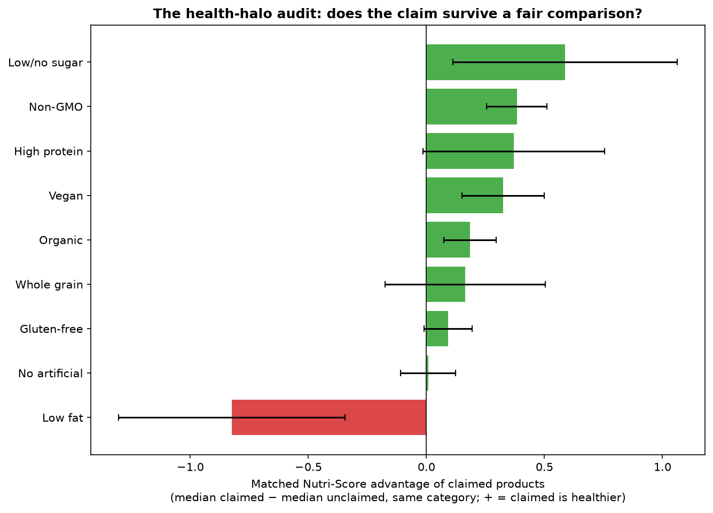
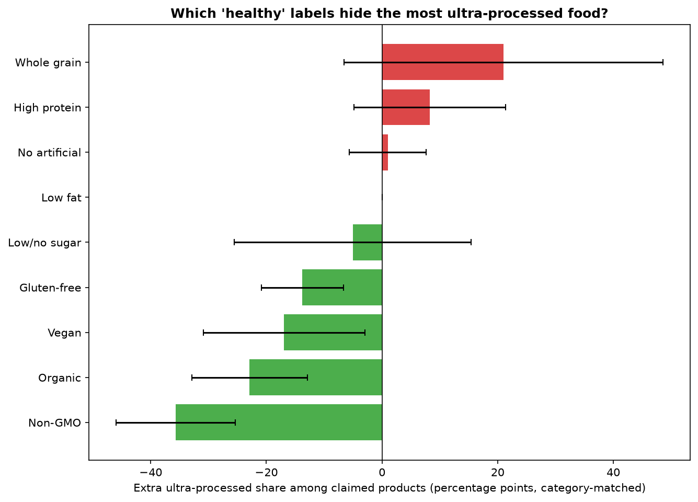
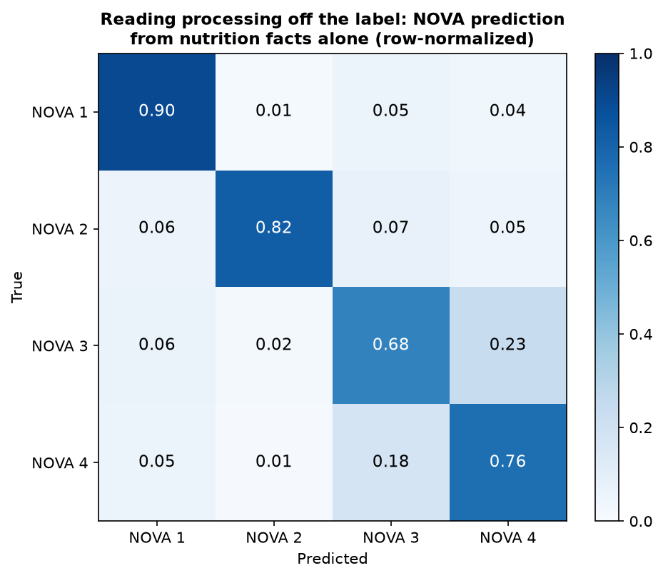
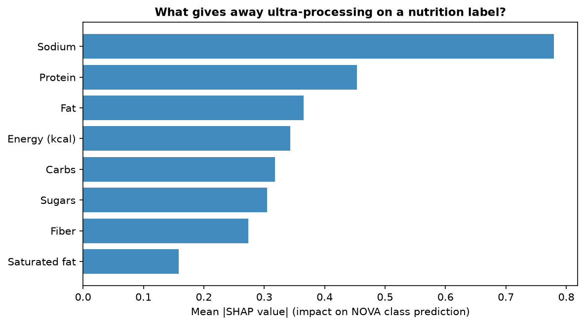
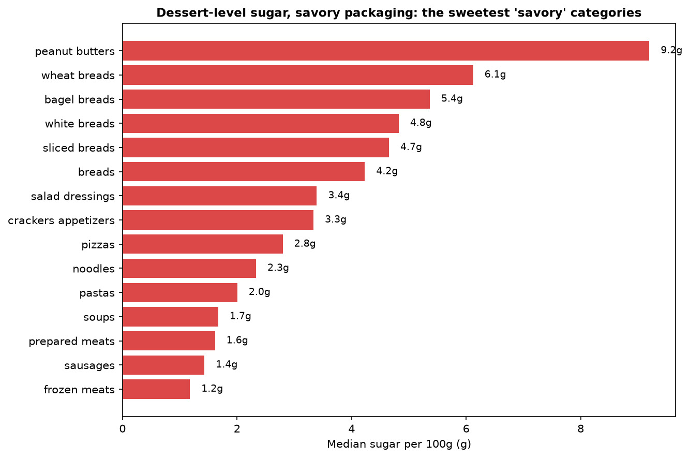
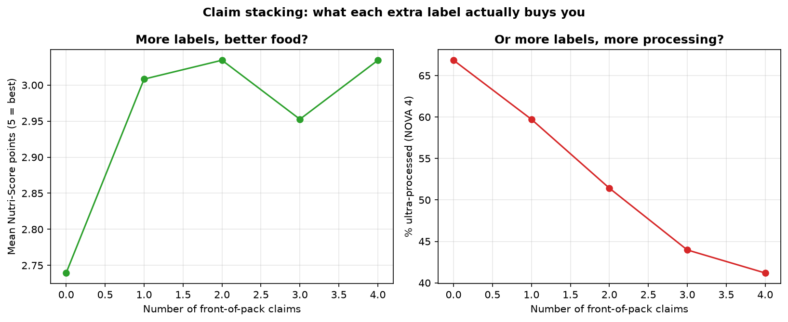

# The Health-Halo Heist: What 57,000 Grocery Labels Taught Me About Who's Lying

**One-line summary:** I audited 57,201 US packaged foods against their own front-of-pack claims. "No artificial flavors" buys you nothing. "Low fat" buys you *more sugar*. A machine-learning model can read ultra-processing straight off the nutrition label — unless the package won't stop bragging. And your "healthy" wheat bread has dessert-level sugar.

## The setup

Walk any grocery aisle and the packages shout at you: HIGH PROTEIN. ALL NATURAL. GLUTEN-FREE. ORGANIC. KETO. The front of the package is advertising. The back — the nutrition facts panel — is the audited financial statement.

So I audited it. I pulled 57,201 US packaged foods from [Open Food Facts](https://world.openfoodfacts.org) (open food database, ODbL license; full 4.5M-row bulk export dated 2026-10-01, uniform reservoir sample of the 910,135 US products with usable data), parsed every front-of-pack health claim from the labels and product names, and asked three questions:

1. **The health-halo audit.** Within the same product category, are foods carrying a "healthy" claim actually healthier — by Nutri-Score, NOVA processing level, sugar, sodium, and saturated fat?
2. **Reading processing off the label.** Can a machine-learning model predict a product's NOVA ultra-processing group from the nutrition facts panel alone? What gives it away?
3. **Hidden sugar + claim stacking.** Which "savory" categories hide dessert-level sugar? And does piling on more labels buy you anything?

## Data & methods

- **Source:** Open Food Facts bulk export (`en.openfoodfacts.org.products.csv.gz`, 1.27 GB). The v2 search API rate-limited us (HTTP 503s), so we downloaded the full export via parallel range requests and reservoir-sampled (seed 42) 57,201 US products with a NOVA group or Nutri-Score grade and ≥3 reported nutrients. Reproduce: `src/download_bulk.py` → `src/01b_sample_bulk.py`. (`src/01_fetch.py` documents the original API approach.)
- **Claims:** 16 front-of-pack claim families (organic, gluten-free, high protein, low fat, low/no sugar, natural, whole grain, keto, paleo, low calorie, non-GMO, vegan, high fiber, no-artificial/clean label, heart healthy, low sodium), detected from `labels_tags` plus product-name keywords. 36.9% of products carry at least one. See `src/02_build_dataset.py` for exact rules.
- **Matched comparisons:** every claim-vs-no-claim comparison is done *within* main category (≥10 claimed and ≥10 unclaimed products per category, ≥5 qualifying categories), then aggregated across categories weighted by claimed-product count — so "gluten-free looks healthy" can't just mean "gluten-free skews toward categories that were healthy anyway." 95% CIs from the weighted category-level deltas.
- **NOVA model:** XGBoost multiclass classifier (400 trees, depth 6) on energy + 8 nutrients per 100g, stratified 80/20 split, class-weighted; SHAP for feature attribution. Baselines: majority-class and logistic regression.
- **Limitations:** Open Food Facts is crowd-sourced; transcription errors exist (we dropped physically impossible values like >100g sugar/100g). NOVA groups on OFF are partly rule-derived from ingredient lists, so the model partly learns those rules back — and claims like non-GMO correlate with short ingredient lists, which flatters their NOVA deltas. The Nutri-Score deltas don't have this problem (computed from nutrients only). Claims detection is keyword-based and misses image-only claims.

## What I found

### 1. The health-halo audit: some labels lie, some tell the truth

**"No artificial flavors / colors" is the purest health halo in the store.** Across 3,052 products in 57 categories, the claim buys you **+0.01 Nutri-Score points** — statistically zero — and no reduction in ultra-processing. It tells you what *isn't* in the food. The data says what *is* in it is no better. This is the label equivalent of a company bragging about what it doesn't do.

**"Low fat" is a negative halo: the claim makes things worse.** Low-fat products score **0.82 Nutri-Score points lower** than same-category products without the claim (significant). The mechanism is right there in the panel: **+2.2g of sugar per 100g**, −0.6g saturated fat. The fat left; the sugar moved in; the net trade was bad. Thirty years of SnackWell's, quantified.

**"Non-GMO" and "Organic" are the honest signals.** Non-GMO: +0.38 Nutri-Score points and **36 percentage points less ultra-processed** (98 categories). Organic: +0.18 points, −23pp ultra-processed. (Caveat above: part of the NOVA gap is definitional — short ingredient lists earn both the claim and the low NOVA grade. The Nutri-Score gap is clean.)

**"Gluten-free" — the most common claim in the store (14.6% of products) — is nutritionally neutral.** +0.09 Nutri-Score points, not significant. It does skew 14pp less ultra-processed, but if you're buying it for health rather than celiac disease, you're buying a story.

**"High protein" and "whole grain" are Trojan horses.** Both score slightly better on Nutri-Score — but whole-grain products are **21 percentage points *more* likely to be ultra-processed** (protein bars, fortified cereals: the nutrients are good, the delivery vehicle is a chemistry set). The CIs are wide, but the direction is the story: the claim is true and the food is still ultra-processed.

### 2. You can read ultra-processing off the nutrition label

An XGBoost model trained *only* on the nutrition facts panel (energy + 8 nutrients per 100g, no ingredient list, no brand, no claims) predicts the 4 NOVA processing groups at **75.9% accuracy** (majority baseline: 72.4%) with **macro-F1 0.68** — and spots ultra-processed food specifically at **92% precision, 76% recall**. The confusion matrix is strongly diagonal: NOVA 1 (unprocessed) is identified at 90% recall.

**What gives it away?** SHAP says: **sodium, by a mile** — then protein, fat, and energy. The single most processed-food thing a label can tell you isn't sugar. It's salt.

And here's the twist: **the more a package brags, the harder it is to read.** Model accuracy is 76.8% on products with zero claims, 72.0% with two claims, **67.4% with three**. Heavy label-talk correlates with unusual nutrient profiles that blur the processing signal — or with noisier NOVA labeling. Either way: the louder the front, the less the back tells you.

### 3. Dessert-level sugar in the savory aisle

Median sugar per 100g in categories nobody thinks of as sweet:

- **Peanut butter: 9.2g** — nearly one gram in ten is sugar. (The worst offenders are the "striped" and cocoa-dusted ones at 30–40g.)
- **Wheat bread: 6.1g. Bagels: 5.4g. Bread overall: 4.2g** (n=6,949). Your "healthy" wheat bread has more sugar per 100g than many desserts.
- Salad dressing (3.4g), crackers (3.3g), pizza (2.8g) round out the list.

### 4. Claim stacking: the labels lie individually but tell the truth in aggregate

Here's the paradox that ties it together. Individual claims are a minefield — "no artificial" means nothing, "low fat" means worse. But **each additional claim on the package buys you ~0.1 Nutri-Score points and ~6pp less ultra-processing**: 0 claims → 2.74 points / 67% UPF; 4 claims → 3.03 / 41% UPF, monotonic.

Why? Because the *honest* claims (non-GMO, organic, vegan) dominate the stacking, and manufacturers only pay for multiple certifications on products that can survive the scrutiny. One label is marketing. Four labels is a due-diligence trail.

## The operator's takeaway

If you remember one thing: **read the back, not the front** — and if you must read the front, distrust single adjectives ("natural," "no artificial," "low fat") while respecting expensive signals (organic certification, non-GMO verification). The cheapest heuristic in the store: flip the package over and check sodium. The model says that's where the processing hides.

## Files

- `src/` — `download_bulk.py` (parallel range-request downloader), `01b_sample_bulk.py` (streaming reservoir sampler), `02_build_dataset.py` (claim parsing + parquet), `03_claims_audit.py` (matched halo audit), `04_nova_model.py` (XGBoost + SHAP), `05_sugar_and_stacking.py` (hidden sugar + stacking). `01_fetch.py` documents the original API approach (abandoned: rate-limited).
- `data/` — `off_us_sample.tsv` (57,201-product uniform sample, raw fields), `products.parquet` (analysis dataset with claim flags).
- `charts/` — the six figures above. `output/` — CSVs/JSON behind every number in this README.
- `requirements.txt` — Python dependencies.
