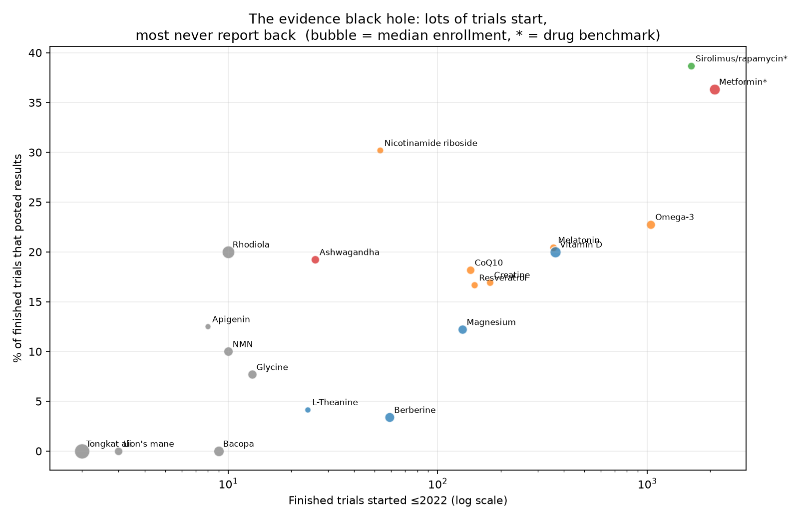
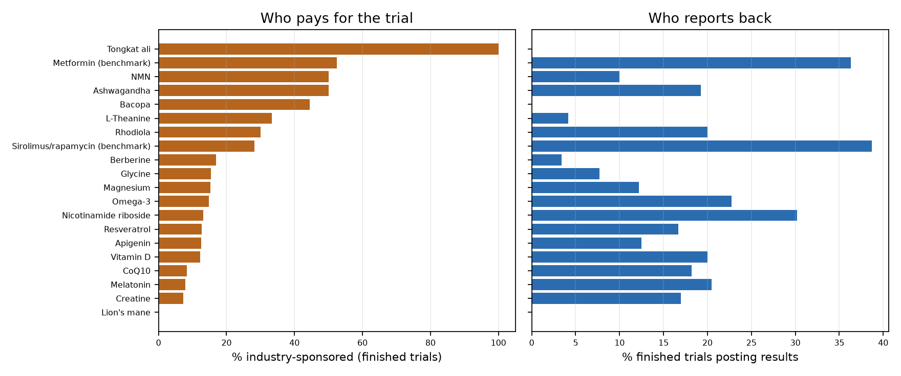
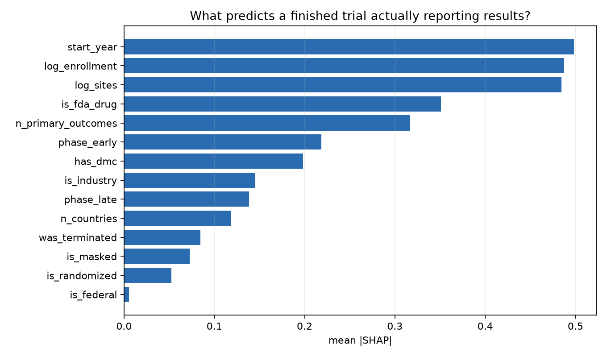
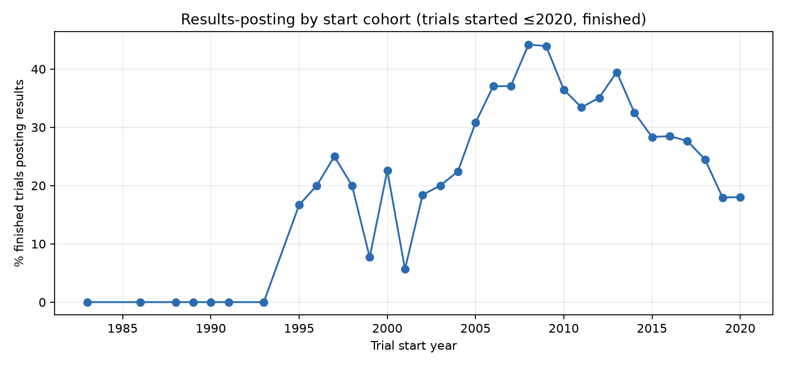
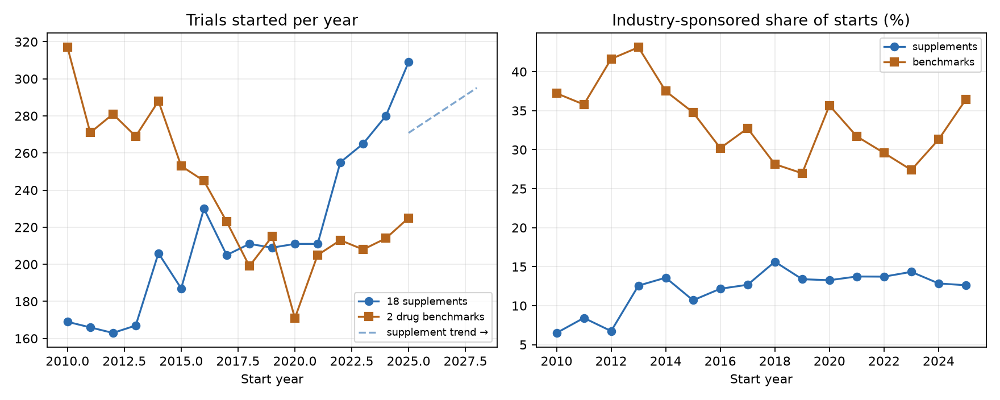

# The Evidence Black Hole: Most Supplement Trials Never Report Back

**Date:** 2026-10-02 · **Topic:** biohacking · Part of the [Daily builds](https://github.com/mzhou-ds/passion-projects) series — *Musing with Mike*

Everyone argues about whether a supplement "works." Almost nobody asks a prior question: when someone actually ran the trial, did we ever hear how it ended?

I pulled every registered trial I could find for 18 supplements longevity stacks are built on — creatine, magnesium, ashwagandha, NMN, NR, resveratrol, melatonin, theanine, omega-3, vitamin D, CoQ10, berberine, lion's mane, bacopa, rhodiola, glycine, tongkat ali, apigenin — plus two drug benchmarks from the same conversation, metformin and sirolimus/rapamycin. 9,864 unique trials from ClinicalTrials.gov. Then I asked who finished, who posted results, and whether you can tell at registration time which trials will go dark.

## What I built

- `src/01_fetch_trials.py` — ClinicalTrials.gov API v2, intervention-by-intervention, parsed to `data/trials.csv` (9,864 unique trials; raw JSONL is gitignored, re-fetchable)
- `src/02_fetch_pubmed.py` — PubMed counts (all + RCT-tagged) per intervention via NCBI E-utilities → `data/pubmed_counts.csv`
- `src/03_evidence_map.py` — per-intervention results-posting rates for mature finished trials, KMeans (k=4) evidence archetypes → `charts/evidence_map.png`, `charts/sponsor_gap.png`
- `src/04_predict_results.py` — XGBoost + SHAP vs logistic baseline predicting `has_results` for 5,815 finished trials started ≤2020 → `charts/shap_importance.png`, `charts/model_by_cohort.png`
- `src/05_trends.py` — trial starts 2010–2025, supplement vs benchmark, naive trend forecast to 2028 → `charts/trends.png`

## Findings

**1. Two-thirds of finished trials never post results. For supplements, it's four-fifths.**
Of finished trials started ≤2020, 31.8% posted results on the registry. Strip out the two drug benchmarks and the supplement-only rate is 21.4% (n=2,286). The trial happened. People enrolled, took the thing, gave the data. It just never came back.

**2. The black hole has names.**
Berberine: 59 finished trials, 3.4% posted results. L-Theanine: 24 finished, 4.2%. Magnesium: 131 finished, 12.2%. NMN — the molecule that launched a thousand longevity podcasts — has 10 mature finished trials in the registry, 1 with results. Bacopa (n=9) and lion's mane (n=3): zero. Small n on the last two, and the README should say so — but "zero of nine" is still zero of nine.

**3. The benchmarks aren't heroes. They're just watched.**
Metformin posted at 36.4%, sirolimus at 38.7%. Better than supplements, still not good. The gap isn't rigor, it's regulation: FDA-regulated drug trials live under reporting obligations supplement trials mostly don't. Remove the watcher and the reporting rate falls off a cliff.

**4. You can predict the disappearance at registration.**
XGBoost predicts which finished trials will post results at AUC 0.818 (logistic baseline: 0.732); supplement-only, AUC 0.795. SHAP says the tells are boring and structural: start year, enrollment, number of sites, FDA-drug status, number of primary outcomes, early phase, having a data monitoring committee. Translation: big, multi-site, regulated, well-specified trials report. Small, single-site, unregulated ones vanish. It's not malice. It's infrastructure.

**5. Sponsors: industry reports, academia registers.**
By lead sponsor: NIH 47.6%, industry 43.1%, "other" (mostly academic) 25.7%, other government 8.1%. The party with a regulator or a product deadline reports back. The party with a CV line and no deadline often doesn't.

**6. The pipeline is accelerating into the void.**
Supplement trial starts rose from 169 (2010) to 309 (2025), and the naive trend points to ~295–309/yr through 2028. Industry share of supplement starts sits at ~13%, vs ~31–36% for the drug benchmarks — flat for 15 years. More trials every year, same low share of sponsors with a reason to report. If the reporting rate doesn't move, the black hole grows ~240 unreported finished trials a year.

**Bottom line:** the supplement evidence base isn't thin because trials don't happen. 2,286 finished supplement trials happened. It's thin because 79% of them never told us the ending. Before you ask "does it work?", ask "did anyone with an obligation to answer ever run it?"

## Charts







## Reproduce

```bash
pip install -r requirements.txt
python3 src/01_fetch_trials.py   # ClinicalTrials.gov API v2, ~10 min
python3 src/02_fetch_pubmed.py   # NCBI E-utilities, throttled
python3 src/03_evidence_map.py
python3 src/04_predict_results.py
python3 src/05_trends.py
```

## Caveats

- `has_results` means structured results posted on ClinicalTrials.gov. Some trials publish in journals without posting; this measures registry transparency, not all publication. That distinction is the point — a journal paper you can't find from the registration is a broken link in the chain.
- Intervention queries are keyword-based (`query.intr`); generic terms sweep in adjacent indications. Counts are upper bounds, consistent with the 2026-09-13 audit.
- Mature-cohort cutoffs (started ≤2022 for the map, ≤2020 for the model) trade sample size for "old enough that silence means silence."
- The 2025–2028 forecast is a naive linear trend on 2015–2024 starts. It's a direction, not a prediction market.
