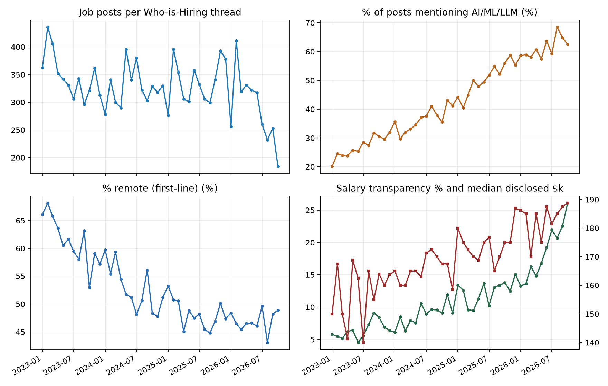
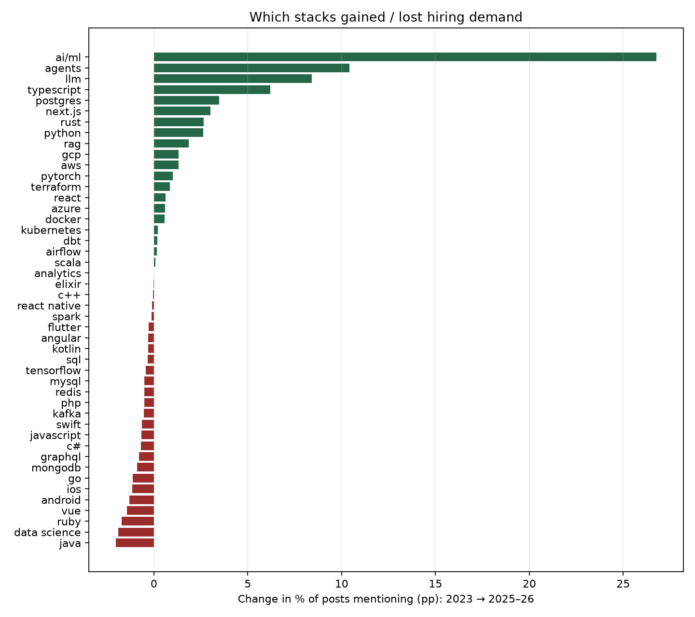
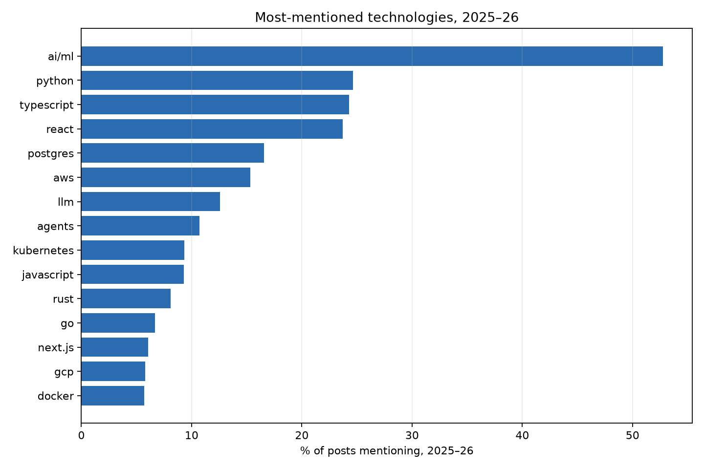
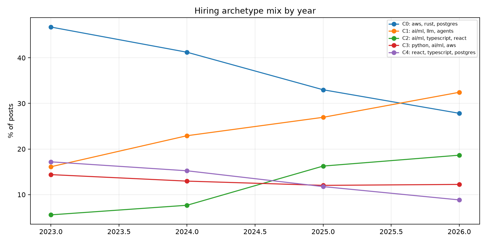
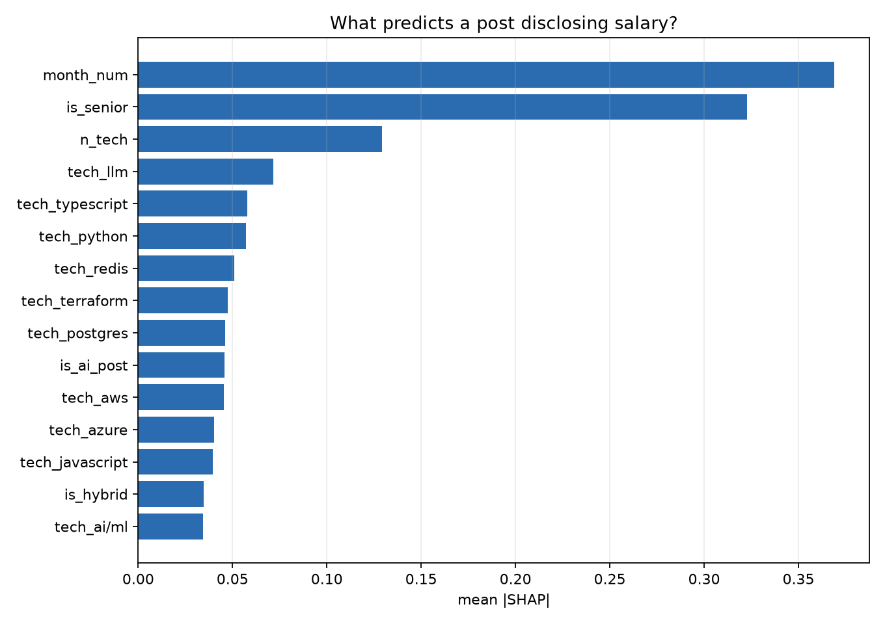

# The Hiring Thread Is the Economy: 15,023 Startup Job Posts, 2023–2026

**Date:** 2026-10-03 · **Topic:** tech-industry · Part of the [Daily builds](https://github.com/mzhou-ds/passion-projects) series — *Musing with Mike*

I spent a decade in two-sided marketplaces — Lyft, DoorDash, Patreon. You learn to read the order book. For tech hiring, the closest thing to a public order book is Hacker News' monthly "Who is hiring?" thread: no recruiter spam tax, no LinkedIn inflation, companies writing their own posts in their own words.

So I read all of it. 46 threads, January 2023 to October 2026, 15,023 job posts. Parsed for stack, work mode, seniority, and salary. Clustered into hiring archetypes. Modeled what makes a company disclose pay.

## What I built

- `src/01_fetch_hiring.py` — Algolia HN API: finds the 46 monthly threads (author `whoishiring`), pulls every top-level comment (= job post) → `data/posts_raw.csv`
- `src/02_parse_posts.py` — regex extraction over 40 technologies, work mode, location buckets, salary ranges (normalized to annual midpoint), seniority, AI-post flags → parsed dataset (gitignored for size; re-runnable)
- `src/03_analyze.py` — monthly trends, 2023 vs 2025–26 tech leaderboard, KMeans (k=5) archetypes, XGBoost + SHAP salary-disclosure model vs logistic baseline

## Findings

**1. AI didn't eat a slice of hiring. It ate the menu.**
Posts mentioning AI/ML/LLM terms: 20% in January 2023, 27% for 2023 as a whole, 51% in 2025, 61% in 2026. The specific tells: "AI/ML" mentions 26% → 53% of posts, "LLM" 4% → 13%, "AI agents" 0.3% → 11%. By August 2026, 69% of posts in a single thread mentioned AI. This is not a category. It's the default setting now.

**2. "Data science" died so "AI" could live.**
The biggest loser on the board isn't Java (-2.0pp) or Ruby (-1.7pp). It's the *label* "data science": 5.0% → 3.1% of posts, while PyTorch doubled and RAG went 0.1% → 1.9%. Same people, same Python, new title. If you're counting "AI jobs" by title, you're measuring a rebrand as much as a revolution — the stack data gives it away.

**3. The winners are boring infrastructure for the AI product era.**
Gains 2023 → 2025–26: TypeScript +6.2pp, Postgres +3.5pp, Next.js +3.0pp, Rust +2.6pp, Python +2.6pp. Losses: mobile (iOS -1.1, Android -1.3), Vue, MongoDB, GraphQL. The market is hiring people to build AI products in TypeScript/Postgres and the systems underneath them in Rust/Python. It's not hiring many people to build native apps.

**4. Remote lost slowly, then kept losing.**
Remote-first posts: 66% in January 2023, 62% for 2023, 53% in 2024, 48% in 2025, 47% in 2026. Not a cliff — a ratchet. Hybrid is where the share went. The classic SaaS full-stack archetype (React/TypeScript/Postgres) is the most remote-friendly cluster at 68%; the pure-AI cluster is the least, at 46%. New paradigm, old office.

**5. Five archetypes run the whole market.**
- *Backend/infra* (AWS, Rust, Postgres) — 5,705 posts, the ballast. Only 2% AI-flagged; these are the jobs that keep the lights on.
- *Pure AI* (AI/ML, LLM, agents) — 3,597 posts, 100% AI-flagged by construction, median disclosed pay $190k, the highest.
- *AI-product full-stack* (AI/ML, TypeScript, React) — 1,728 posts, highest salary-disclosure rate (15%).
- *Data/ML platform* (Python, AI/ML, AWS) — 1,948.
- *Classic SaaS full-stack* (React, TypeScript, Postgres) — 2,045, most remote, lowest median disclosed pay ($162.5k).

Two AI-native archetypes account for 5,325 of 15,023 posts across the window — and they're still growing (see `charts/archetypes.png`).

**6. Salary transparency tripled — and you can see the law in the data.**
Posts disclosing a salary range: 5.8% in January 2023 → 6.4% (2023), 8.8% (2024), 12.4% (2025), 17.9% (2026, with full months at 13–23%). Median disclosed midpoint rose $160k → $185k over the same span. The XGBoost disclosure model (AUC 0.76 vs 0.69 logistic) says the top predictor is simply *time* — SHAP ranks thread month first, seniority second. That's what a policy ratchet (CA/NY/CO/WA pay-transparency laws phasing in) looks like from inside a job board: not a stack, not a company type. A date.

**7. Among companies that disclose, AI pays a visible premium.**
Disclosed median: AI posts $185k vs non-AI $165k — a $20k gap at the median. Caveat stated flatly: this is among the ~11% who disclose at all, and AI posts skew senior. It's a premium signal, not a causal estimate.

**Bottom line:** LinkedIn will tell you AI is a bubble or a revolution. The order book says something drier: three-fifths of startup job posts now mention AI, the tools being hired for are Postgres and TypeScript, remote is bleeding a point a quarter, and pay transparency is winning because the law said so. Read the hiring thread. It's the economy, written by the people spending the money.

## Charts







## Reproduce

```bash
pip install -r requirements.txt
python3 src/01_fetch_hiring.py   # Algolia HN API, ~2 min, 46 threads
python3 src/02_parse_posts.py
python3 src/03_analyze.py
```

## Caveats

- Who-is-Hiring skews startup/remote-tech and self-selected posters; it is a *signal* about the startup labor market, not BLS employment. October 2026 is a partial thread (posted Oct 1, scraped Oct 3).
- Regex tech detection misses stacks described in prose ("our backend is in Go" is caught; "Golang shop" usually is too — both patterns included — but no parser is perfect). `ts`/`go` bare-token false positives were guarded with lookahead contexts.
- Salary parsing captures `$Xk–$Yk` and `$X,000–$Y,000` patterns in post text; equity, bonuses, and non-USD ranges are not normalized.
- The AI premium (finding 7) is descriptive among disclosers only; seniority and archetype confound it, and the README does not pretend otherwise.
